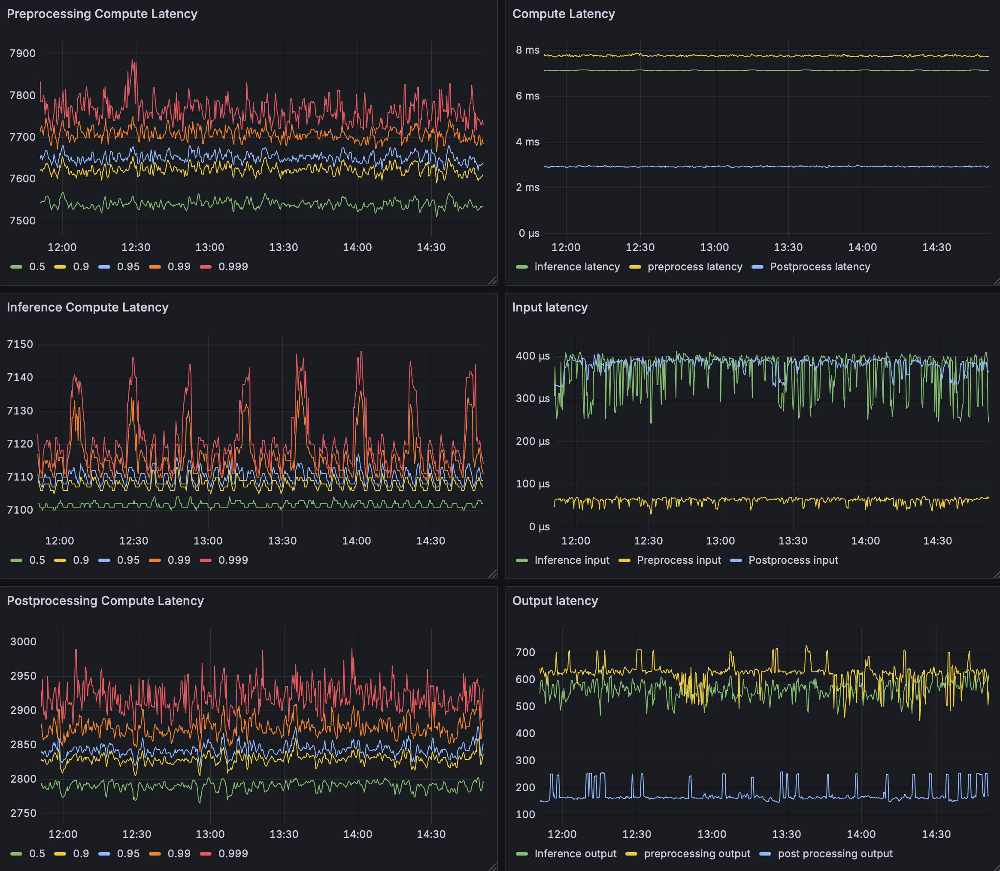

# Inference Monitoring Stack (Prometheus + Grafana)

**AI Inference 서버의 실시간 모니터링**을 위한 기본 스택 구성 예시를 제공합니다.  
`Prometheus`가 서버 메트릭을 수집하고, `Grafana`가 이를 시각화하여 인퍼런스 파이프라인의 성능을 한눈에 파악할 수 있습니다.

---

## 📦 구성 개요

### 1. Prometheus
- **역할:**  
  메트릭 수집기.  
  인퍼런스 서버(Triton Inference Server 등) 또는 관련 Exporter(Node, DCGM 등)에서 데이터를 스크레이프(Scrape)합니다.

- **주요 기능:**  
  - GPU/CPU 사용률, 전력 사용량
  - 각 모델별 추론 지연(latency), 큐 대기 시간, I/O 지연 등

- **설정 파일:** `prometheus/prometheus.yml`
  - `scrape_configs` 항목의 `targets`에서 **호스트 주소 또는 컨테이너 주소**를 수정해야 합니다.

  ```yaml
  scrape_configs:
    - job_name: 'triton'
      static_configs:
        - targets: ['<YOUR_HOST_IP>:8002']   # Triton metrics endpoint
  ```

  > 예를 들어 Triton 서버가 호스트에서 8002 포트를 통해 노출된다면  
  > `targets: ['host.docker.internal:8002']` 또는 실제 IP로 변경하십시오.

---

### 2. Grafana
- **역할:**  
  Prometheus가 수집한 메트릭을 시각화하는 대시보드 서버입니다.

- **대시보드:**  
  `/grafana/provisioning/dashboards/boards/triton.json`  
  이 JSON 파일은 Triton 기반 인퍼런스 환경에 특화된 커스텀 대시보드를 포함합니다.

- **표시되는 주요 항목**
  | 구분 | 설명 |
  |------|------|
  | **Preprocessing Compute Latency** | 전처리 단계 연산 지연 |
  | **Inference Compute Latency** | 모델 추론 단계 지연 |
  | **Postprocessing Compute Latency** | 후처리 단계 연산 지연 |
  | **Input / Output Latency** | 입출력 단계별 지연 |
  | **Queue Delay** | 요청 대기 시간 |
  | **E2E Request Latency** | 전체 요청-응답 지연 |
  | **CPU Usage / GPU Usage** | 시스템 자원 사용량 (DCGM, Node Exporter 등 기반) |

---

## ⚙️ 사용 방법

### 1. 의존성
- Docker (또는 nerdctl)
- Docker Compose v2 이상

### 2. 실행
```bash
docker compose up -d
```
또는 containerd 환경에서는:
```bash
nerdctl compose up -d
```

기본 포트:
- Grafana → [`http://localhost:3000`](http://localhost:3000)
- Prometheus → [`http://localhost:9090`](http://localhost:9090)

### 3. Grafana 접속 및 로그인
초기 ID/PW: admin/admin
로그인 후 패스워드 변경 권장

이후 대시보드를 통해 인퍼런스 서버의 현황 파악 가능
<p align="center">
  
</p>

---

## 🔧 설정 커스터마이징

### Prometheus
- `prometheus/prometheus.yml`에서 **스크레이프 대상 수정**
  (예: Triton, Node exporter, DCGM exporter 등)
- `scrape_interval`, `evaluation_interval` 조정 가능

### Grafana
- `grafana/provisioning/datasources/prometheus.yaml`
  Prometheus 서버 주소 수정:
  ```yaml
  url: http://prometheus:9090
  ```
  외부 Prometheus를 사용할 경우 실제 주소로 변경하세요.

- 대시보드 자동 로딩은 `grafana/provisioning/dashboards/dashboards.yaml`에 정의되어 있습니다.

---

## 📊 예시 아키텍처

```
                     ┌──────────────────────────────┐
                     │     Triton Inference Host    │
                     │ ┌──────────────────────────┐ │
                     │ │  Exporters (DCGM / Node) │ │
                     │ └──────────────────────────┘ │
                     └──────────────┬───────────────┘
                                    │  (HTTP /metrics)
                                    │
                                    ▼
                     ┌──────────────────────────────┐
                     │          Prometheus          │
                     │  ─────────────────────────   │
                     │  • scrape_targets 설정       │
                     │  • 메트릭 수집               │
                     └──────────────┬───────────────┘
                                    │
                                    ▼
                     ┌──────────────────────────────┐
                     │            Grafana           │
                     │  ─────────────────────────   │
                     │  • Prometheus 데이터 시각화  │
                     │  • triton.json 대시보드 제공 │
                     └──────────────────────────────┘
```

---

## 🧩 주요 디렉터리 구조

```
.
├── docker-compose.yml
├── prometheus/
│   └── prometheus.yml
└── grafana/
    └── provisioning/
        ├── datasources/
        │   └── prometheus.yaml
        └── dashboards/
            ├── dashboards.yaml
            └── boards/
                └── triton.json
```

---

## 🛠️ Troubleshooting

| 문제 | 원인 | 해결 방법 |
|------|------|------------|
| Grafana 대시보드에 "No data" | Prometheus가 메트릭을 수집하지 못함 | `prometheus.yml`의 `targets` 확인 및 Triton Metrics Endpoint 접근 가능 여부 점검 |
| 일부 패널에 빨간 경고 표시 | Grafana 데이터소스 UID 불일치 | `datasources/prometheus.yaml`의 UID 수정 또는 JSON에서 변수화 |
| 포트 충돌 | 기존 컨테이너 실행 중 | `docker ps`로 확인 후 중복 컨테이너 중지 |

