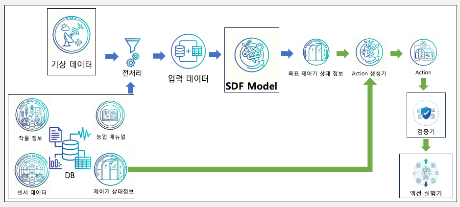
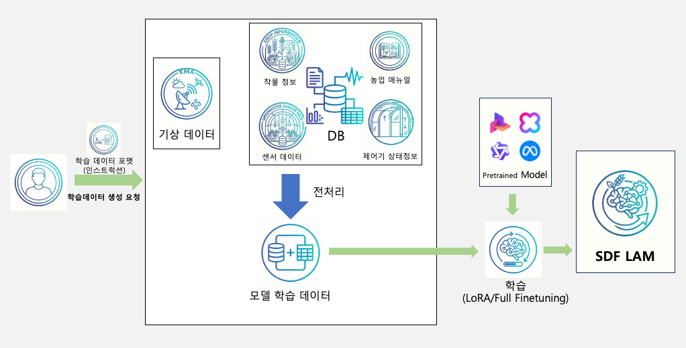

# SDF (Smart Decision Framework)

스마트팜 환경에서 센서 데이터, 기상 데이터, 작물/농업 정보를 기반으로 최적 제어 액션을 생성하는 AI 의사결정 프레임워크입니다.

## 아키텍처



기상 데이터와 센서 데이터/DB/제어기 상태 정보를 전처리하여 SDF Model에 입력하면, 목표 제어기 상태 정보를 기반으로 Action을 생성하고 검증기를 거쳐 액션 실행기로 전달합니다.

## 폴더 구조

```
SDF/
├── 원시데이터 수집기/   # 스마트팜 센서 원시 데이터 수집 파이프라인
├── 원천데이터 생성기/   # KMA 기상 데이터 병합, 이상치 제거, 학습용 데이터셋 생성
├── LAM 학습,추론/       # SDF Model (xLAM 기반) 파인튜닝 및 추론
├── 제어기/              # 온실 제어기 장치/시설 정의 및 관련 문서
├── scripts/             # 공통 유틸리티 스크립트
└── docs/                # 문서 및 이미지
```

### 원시데이터 수집기
스마트팜 센서로부터 수집한 원시 데이터를 csv의 형태로 수집하는 파이프라인입니다.

### 원천데이터 생성기
KMA(기상청) 기상 데이터를 센서 데이터와 병합하여 모델 학습에 사용할 원천 데이터셋을 생성합니다.

### LAM 학습,추론
xLAM 기반 SDF 모델의 파인튜닝(`02_모델 학습`)과 추론(`03_추론`)을 담당합니다. 제어기 상태 정보를 입력받아 액션을 생성합니다.



기상 데이터, 센서 데이터, 작물 정보 등을 전처리하여 모델 학습 데이터를 만들고, Pretrained Model을 LoRA 또는 Full Finetuning 방식으로 학습하여 SDF LAM을 생성합니다.

### 제어기
온실 내 장치(`devices`) 및 시설(`facilities`) 정의와 제어기에게 명령을 전달하는 부분입니다.