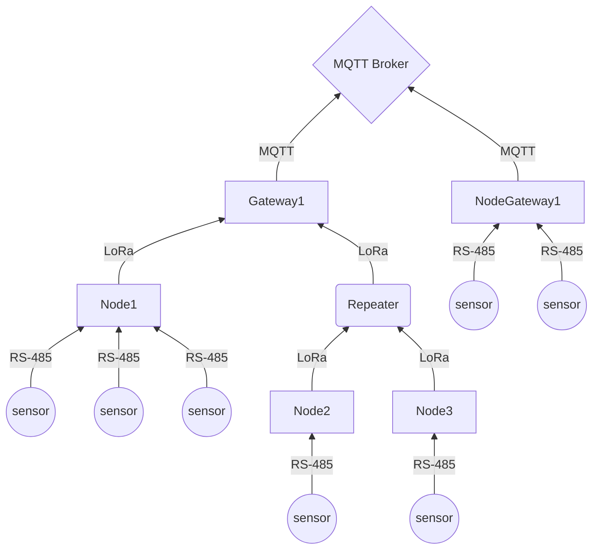

# 개요

## Beymons 디바이스

- Gateway
    - Node로 부터 전송받은 데이터를 수집 서버로 전송한다.
- Node
    - 각종 센서들이 출력하는 값을 읽는 Device를 의미한다.
    - 데이터를 Gateway로 전송한다.
- NodeGateway
    - 단일 동작을 할 경우에는 Gateway로 보내지 않고 수집 서버에 직접 데이터를 전송한다.
    - Node이지만, Gateway 역할을 모두 수행한다.
    - 이 경우, MQTT 프로토콜에서 Gateway ID 와 Node ID 를 나타내는 영역에 모두 해당 디바이스의 ID를 사용한다.
- Repeater
    - Node와 Gateway 간 물리적인 거리 혹은 무선 환경 등의 이유로 직접 연결이 불가능 한 상황에서 신호를 중계하는 역할만 수행한다.
    - 센서에 직접 연결되지 않는다.
- 센서 모듈, 제어 모듈
    - Node에 연결되어 주변 정보를 직접 수집하는 역할을 수행한다.
    - 현재 정의된 센서의 종류는 다음과 같다.
        - 온습도, 진동, 소음, 카운트, 전압, 전류, relay

## 연결 형태

베이몬스 디바이스들 간 연결은 다음과 같은 형태로 구성될 수 있다.

- Sensor - Node
  - 하나의 노드에 여러 개의 센서가 연결될 수 있다.
  - 각 센서들은 일반적으로 [RS-485](https://ko.wikipedia.org/wiki/EIA-485)를 통해 [MODBUS](https://ko.wikipedia.org/wiki/%EB%AA%A8%EB%93%9C%EB%B2%84%EC%8A%A4) 프로토콜을 사용하여 통신하며, `슬레이브 주소`를 기준으로 구분된다.
- Sensor - NodeGateway
  - 센서는 일반적으로 노드에 연결되지만, Gateway의 역할을 수행하는 디바이스에 연결될 수도 있다. 

## 연결 형태에 따른 프로토콜

위 도식에도 표현했듯이, 디바이스 계층에 따라 통신을 위한 프로토콜이 달라진다.

- sensor: RS-485 통신 지원
- Beymons Device: RS-485, LoRa, MQTT(Gateway인 경우) 지원

# [제품군](/applications)

## [AGS](/applications/ags)
Beymons GREEN

## [HPS](/applications/hps)
Beymons BLUE

## [DAQ](/applications/daq)
Beymons RED

# 버전

## FW 버전 관리 안

## 디바이스 타입 별 프로젝트

# 통신 프로토콜 ([MQTT](/messages/mqtt))

- 시스템 운영에 필요한 기능을 수행하기 위한 통신을 수행하는데, 이를 기능별로 분리하여 정의한다.
- 여기에서는 베이몬스 응용에 관계 없이 공통적으로 사용 가능한 프로토콜을 명시한다.

## 데이터 전송

일반적으로 센서 데이터를 전송하는 경우 서버에서 응답은 하지 않는다.

- [센서 데이터](/protocol/data/sensor_data)

## [명령 전송](/protocol/command)

- [시간 동기화](/protocol/command/get_time)
- [설정 조회](/protocol/command/get_config)
- [설정 변경](/protocol/command/set_config)
- [최근 데이터 조회](/protocol/command/get_latest_value)
- [디바이스 에러 보고](/protocol/command/set_status)
