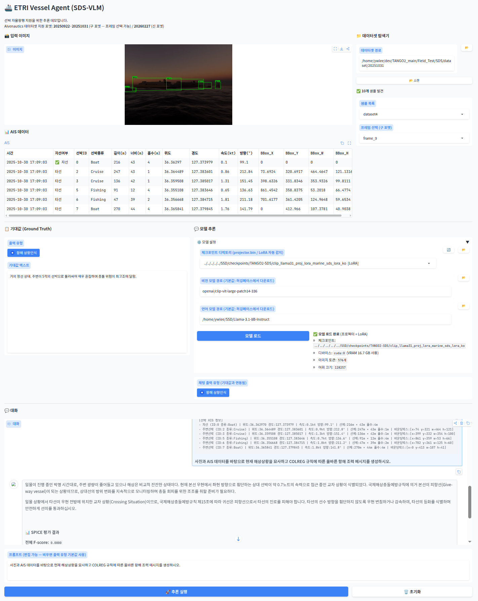

# EVA: ETRI Vessel Agent (SDS-VLM)

선박 자율항행 지원을 위한 Vision-Language Model (VLM) 구현입니다.  
CLIP 비전 인코더와 Llama 3.1 / Qwen3 언어 모델을 MLP 프로젝터로 연결하는 LLaVA 구조이며,  
SDS(Software-defined Ship) 해상 도메인 데이터셋에 특화된 학습 파이프라인을 제공합니다.

---

## 목차

1. [아키텍처 개요](#1-아키텍처-개요)
2. [실험환경](#2-실험환경)
3. [가상환경 구성](#3-가상환경-구성)
4. [모델 가중치 준비](#4-모델-가중치-준비)
5. [데이터셋 준비](#5-데이터셋-준비)
6. [동작 확인 (로드 테스트)](#6-동작-확인-로드-테스트)
7. [학습 파이프라인](#7-학습-파이프라인)
8. [GAA — Geometric Attention Alignment](#8-gaa--geometric-attention-alignment)
9. [추론 테스트](#9-추론-테스트)
10. [데모 웹 앱](#10-데모-웹-앱)
11. [프로젝트 구조](#11-프로젝트-구조)
12. [W&B 학습 모니터링](#12-wb-학습-모니터링)
13. [가중치 변환 — vLLM / llama.cpp](#13-가중치-변환--vllm--llamacpp)

---

## 1. 아키텍처 개요


- 본 구조도는 선박 및 해양 도메인 특화 데이터(**SDS Domain Data**)를 효율적으로 학습하여 해상 상황 묘사 및 항해 조언을 수행하는 **ETRI Vessel Agent** 의 멀티모달 아키텍처를 보여줍니다.

- 기존 LLM과 Vision Encoder는 고정(frozen)한 상태로, **Projector**와 **LoRA Adapter**만을 선택적으로 파인튜닝하는 효율적인 구조를 채택하고 있습니다.

### 1-1. 입력부 (Inputs)

멀티모달 처리를 위해 두 가지 형태의 서로 다른 데이터가 시스템의 시작점으로 입력됩니다.

> **Image (이미지)**
>* 분석 대상이 되는 해상 관련 시각 자료(예: 선박 주변 전경).


> **Text Prompt (텍스트 프롬프트)**
>* 사용자의 질의문 또는 **AIS(선박 자동 식별 시스템, Automatic Identification System)** 데이터를 기반으로 생성된 텍스트 명령지시어.

### 1-2. 시각 정보 처리부 (Vision Processing)

입력된 이미지를 언어 모델이 이해할 수 있는 형태(토큰)로 변환하고 정렬하는 구간입니다.

> **CLIP Vision Encoder (`ViT-L/14`)**
>* **설명:** OpenAI의 CLIP 모델을 백본으로 삼아 이미지에서 고차원의 시각적 특징을 추출합니다.
>* **상태:** 🔒 **Frozen (고정)** — 기구축된 시각 인식 능력을 유지하기 위해 가중치를 업데이트하지 않습니다.


> **Image Embeddings**
>* Vision Encoder로부터 출력된 고차원 이미지 특징 벡터 데이터입니다.


> **Projector (`Multi Layer Perceptron`)**
>* **설명:** 이미지 임베딩을 언어 모델(LLM)이 단어처럼 인식할 수 있는 공간인 `Image Tokens`로 매핑해 주는 **MLP(다층 퍼셉트론)** 구조의 연결 다리입니다.
>* **상태:** ✏️ **Trainable (학습 가능)** — 시각 정보와 언어 정보 간의 도메인 정렬을 위해 이 영역의 가중치는 **Full Tuning** 방식으로 직접 학습됩니다.

### 1-3. 융합 및 언어 모델부 (Multimodal Fusion & LLM)

시각 토큰과 텍스트 토큰을 결합하여, 도메인 특화 지식을 바탕으로 추론을 수행하는 핵심 두뇌 구간입니다.

> **Concatenate (연결)**
>* Projector를 거쳐 나온 `Image Tokens`와 사용자가 입력한 `Text Prompt` 토큰을 하나의 시퀀스로 길게 이어 붙여 LLM의 입력값으로 전달합니다.


> **Language Model (`Llama / Qwen`)**
>* **설명:** 시스템의 텍스트 생성 및 추론을 담당하는 대형 언어 모델(LLM) 백본입니다.
>* **상태:** 🔒 **Frozen Backbone (고정)** — 수십~수백억 개의 거대한 파라미터 본체는 연산 자원 절약 및 기본 언어 능력 보존을 위해 고정됩니다.


> **LoRA Adapter (`Linear Adapter`)**
>* **설명:** 고정된 LLM 레이어 옆에 병렬로 삽입되는 초소형 가중치 행렬 쌍(Linear Adapter)입니다.
>* **상태:** ✏️ **Trainable (학습 가능)** — 하단의 SDS Domain Data (Specific Dataset)인 선박/해양 전문 데이터를 주입받아 이 어댑터 영역만 집중적으로 파인튜닝(PEFT)됩니다.

### 1-4. 출력부 (Output)

모델이 최종 연산을 마치고 사용자에게 도메인 지식을 전달하는 단계입니다.

>**Text Tokens**
>* LLM과 LoRA 어댑터의 협업을 통해 생성된 언어 토큰 시퀀스입니다.


>**Output: Domain-Specific Response**
>* **최종 결과물:** 일반적인 답변을 넘어, 주입된 전문 데이터를 기반으로 생성된 **해상 상황 묘사(Description of sea conditions)** 및 **항해 조언(Navigation advice)** 등의 도메인 특화 답변을 출력합니다.


### 1-5. 학습 파이프라인

| 단계 | 스크립트 | 데이터 | 학습 대상 | 고정                | 목적 |
|------|---------|--------|-----------|-------------------|------|
| Phase 1 | `train_projector.sh` | CC3M 595K | Projector | CLIP + LLM        | 이미지↔텍스트 임베딩 정렬 |
| Phase 2 | `train_lora.sh` | CC3M 595K | Projector + LoRA | CLIP + LLM        | 일반 시각-언어 파인튜닝 |
| Phase 3 | `train_lora_marine.sh` | LLaMarine 54K (텍스트 전용) | LoRA | CLIP + Projector + LLM | 해양 도메인 지식 주입 |
| Phase 4 | `train_lora_sds.sh` | SDS 100개 (이미지+텍스트) | Projector + LoRA | CLIP + LLM        | SDS 태스크 특화 |
| Phase 4-GAA | `train_lora_gaa.sh` | SDS 100개 + BBox | CLIP + Projector + LoRA | LLM               | GAA 기하 어텐션 정렬 |

> * Phase 3 는 이미지 없이 텍스트만 사용하므로 Vision Encoder / Projector를 로드하지 않고 LoRA Adapter 만 학습합니다.  
> * Phase 4-GAA는 Phase 4와 동일한 SDS 데이터를 사용하되 바운딩 박스 어노테이션이 추가로 필요합니다. 자세한 내용은 [§8 GAA](#8-gaa--geometric-attention-alignment)를 참조하세요.

---

## 2. 실험환경

| 항목         | 사양                                           |
|------------|----------------------------------------------|
| CPU        | Intel(R) Xeon(R) Gold 6348 CPU @ 2.60GHz × 2 |
| RAM        | 1TB                                          |
| GPU        | NVIDIA A100 (40GB) × 6                       |
| GPU Driver | 590.48.01                                    |
| CUDA       | 12.8                                         |
| cuDNN      | 9.20.0                                       |
| OS         | Ubuntu 24.04                                 |

---

## 3. 가상환경 구성

### 3-1. Miniforge 설치

```bash
wget "https://github.com/conda-forge/miniforge/releases/latest/download/Miniforge3-$(uname)-$(uname -m).sh"
bash Miniforge3-$(uname)-$(uname -m).sh -b -p $HOME/miniforge3
$HOME/miniforge3/bin/conda init bash # 또는 zsh
source ~/.bashrc # 또는 source ~/.zshrc 
```

### 3-2. 채널 설정 확인

> **중요: 라이센스 문제**  
> Anaconda 기본 채널(`defaults`)은 상업적 환경에서 유료입니다.  
> 연구·기관 환경에서는 반드시 `defaults`를 삭제하고 아래 무료 채널만 사용하십시오.

```bash
# Miniforge 는 conda-forge 를 기본 채널로 사용함
# nvidia, pytorch 채널을 추가할 것

conda config --add channels nvidia
conda config --add channels pytorch
conda config --show channels
```

올바른 출력:
```
channels:
  - nvidia
  - pytorch
  - conda-forge
```

### 3-3. 가상환경 생성

```bash
conda create -n eva python=3.11 pip -y
conda activate eva  # 이후 모든 코드는 가상환경이 활성화되어 있다고 가정함
```

### 3-4. PyTorch 설치 (CUDA 12.8)

```bash
pip install torch==2.11.0 torchvision --index-url https://download.pytorch.org/whl/cu128
```

설치 확인:
```bash
python -c "import torch; print(torch.__version__); print('CUDA:', torch.cuda.is_available())"
# 출력 예: 2.11.0+cu128   CUDA: True
```

### 3-5. 나머지 패키지 설치

```bash
pip install \
    transformers==5.3.0 \
    tokenizers==0.22.2  \
    huggingface_hub==1.7.2  \
    safetensors==0.7.0  \
    peft==0.18.1  \
    accelerate==1.13.0  \
    deepspeed==0.18.8 \
    sentencepiece==0.2.1  \
    einops==0.8.2 \
    wandb==0.26.1 \
    torchinfo==1.8.0  \
    gradio==6.14.0  \
    pillow==12.1.1  \
    pandas==3.0.1 \
    numpy==2.4.3  \
    tqdm==4.67.3  \
    requests==2.32.5  \
    psutil==7.2.2 \
    triton==3.6.0
```

### 3-6. Flash Attntion 2 빌드 및 설치

- RAM 이 충분하다면 빠른 빌드를 위해 MAX_JOBS 의 숫자를 높입니다.
- MAX_JOBS=1 이면 64GB RAM 에서 빌드 가능

```bash
MAX_JOBS=1 pip install flash-attn==2.8.3 --no-build-isolation
```
---

## 4. 모델 가중치 준비

- TANGO2 디렉토리는 $HOME 경로에 있다고 가정합니다

```bash
cd ~/TANGO2/Field_Test/SDS/VisionLanguageModel/
```

- Hugging Face - Access Token 을 발급받고 로그인 합니다.

```bash
hf auth login
```

### 비전 모델 다운로드

```bash
hf download openai/clip-vit-large-patch14-336 \
    --local-dir ~/clip-vit-large-patch14-336
```

결과물:

```bash
clip-vit-large-patch14-336
├── config.json
├── merges.txt
├── preprocessor_config.json
├── pytorch_model.bin
├── README.md
├── special_tokens_map.json
├── tf_model.h5
├── tokenizer_config.json
├── tokenizer.json
└── vocab.json
```

### 언어 모델 다운로드

- Llama 3.1 8B Instruct 는 Meta 라이센스 동의를 필요로 합니다.

```bash
hf download meta-llama/Llama-3.1-8B-Instruct \
    --local-dir ~/Llama-3.1-8B-Instruct
```

결과물:

```bash
Llama-3.1-8B-Instruct
├── config.json
├── generation_config.json
├── LICENSE
├── model-00001-of-00004.safetensors
├── model-00002-of-00004.safetensors
├── model-00003-of-00004.safetensors
├── model-00004-of-00004.safetensors
├── model.safetensors.index.json
├── original
│   ├── consolidated.00.pth
│   ├── params.json
│   └── tokenizer.model
├── README.md
├── special_tokens_map.json
├── tokenizer_config.json
├── tokenizer.json
└── USE_POLICY.md
```

- Qwen3 8B 모델도 다운로드 합니다.

```bash
hf download Qwen/Qwen3-8B \
    --local-dir ~/Qwen3-8B
```

결과물:

```bash
Qwen3-8B
├── config.json
├── generation_config.json
├── LICENSE
├── merges.txt
├── model-00001-of-00005.safetensors
├── model-00002-of-00005.safetensors
├── model-00003-of-00005.safetensors
├── model-00004-of-00005.safetensors
├── model-00005-of-00005.safetensors
├── model.safetensors.index.json
├── README.md
├── tokenizer_config.json
├── tokenizer.json
└── vocab.json
```

---

## 5. 데이터셋 준비

### LLaVA-CC3M-Pretrain-595K

- 다운로드 후에는 images.zip 을 직접 압축 해제해야 합니다.

```bash
hf download liuhaotian/LLaVA-CC3M-Pretrain-595K \
    --local-dir ~/LLaVA-CC3M-Pretrain-595K \
    --repo-type dataset
```

결과물:

```bash
LLaVA-CC3M-Pretrain-595K
├── chat.json
├── images
│   ├── GCC_train_000000000.jpg
│   ├── GCC_train_000000001.jpg
│   ...
├── images.zip
├── metadata.json
└── README.md
```

### LLaMarine-SFT (텍스트 전용 해양 도메인)

- [Llamarine](https://huggingface.co/pentagoniac/llamarine) 에서 구축한 54,657개의 해양 instruction-output 쌍으로 구성된 영문 텍스트 전용 데이터셋입니다.  
- 이미지 없이 해양 도메인 지식(AIS, COLREG, 충돌 회피 등)을 LLM 에 주입합니다.

```bash
hf download pentagoniac/llamarine-sft \
    --local-dir ~/llamarine-sft \
    --repo-type dataset
```

결과물:

```bash
llamarine-sft/
├── data
│   └── train-00000-of-00001.parquet
└── README.md
```

### SDS 데이터셋

- `TANGO2/Field_Test/SDS/dataset/20260227/` 경로의 데이터셋을 기준으로 합니다. 

```bash
{sample_id}/
├── input_image.png           # 1920×1080 해상 시뮬레이션 이미지
├── input_data.csv            # AIS 데이터 (자선/타선 위치·속도·방향·bbox)
├── output_describe_en.txt    # 영문 해상상황묘사
├── output_describe_kor.txt   # 국문 해상상황묘사
├── output_advice_en.txt      # 영문 항해조력메시지
├── output_advice_kor.txt     # 국문 항해조력메시지
└── output_advice_compact.txt # 간결 국문 항해조력메시지
```

- 변환 스크립트를 사용하여 LLaVA 구조 학습을 위한 JSON 포맷으로 변환합니다.

```bash
python scripts/prepare_sds_dataset.py \
    --dataset_dir TANGO2/Field_Test/SDS/dataset/20260227/
```

결과물 (3가지 시나리오 생성):
```bash
data/
├── sds_train_en.json         # 100개: 영문 해상상황묘사 + 영문 항해조력
├── sds_train_ko.json         # 100개: 한글 해상상황묘사 + 한글 항해조력
└── sds_train_ko_compact.json # 100개: 한글 간결 항해조력
```

JSON 샘플의 형식:
```json
{
  "id": "{sample_id}_en",
  "image": "{sample_id}/input_image.png",
  "conversations": [
    {
      "from": "human",
      "value": "<image>\n[Vessel AIS Information]\n...\n\nBased on the camera image and AIS data provided, describe the current maritime situation and provide appropriate navigational advice in accordance with COLREG rules."
    },
    {
      "from": "gpt",
      "value": "{output_describe_en}\n\n{output_advice_en}"
    }
  ]
}
```

---

## 6. 동작 확인 (로드 테스트)

- 학습을 시작하기 전 시각모델 및 언어모델의 구조와 forward pass가 정상인지 확인합니다.

```bash
# 스크립트 파라미터 정의
python load_test.py  \
        --vision \        # 비전 모델 경로
        --llm \           # 언어 모델 경로
        --device \        # CPU, 또는 GPU
        --dtype \         # bfloat16, float16, float32
        --generate \      # 텍스트 응답 생성 유무, 인자 전달  없으면 테스트만
        --test_image      # 테스트 이미지 경로

# 사용 예시
python load_test.py  \
        --vision      openai/clip-vit-large-patch14-336 \
        --llm         ~/Llama-3.1-8B-Instruct \
        --device      GPU \
        --dtype       bfloat16 \
        --test_image  ~/TANGO2/Field_Test/SDS/dataset/20250922/dataset1/frame_1.png \
        --generate
```

정상 출력 시 마지막 줄:

```bash
ALL CHECKS PASSED — Model architecture is functional
```

---

## 7. 학습 파이프라인

### Phase 1 — Projector 사전학습

- 비전 인코더와 LLM 을 고정하고 MLP 프로젝터만 학습합니다.
- `scripts/train_projector.sh` 파일의 변수를 본인 환경에 맞게 수정 후 실행합니다.

```bash
bash scripts/train_projector.sh

# 멀티 GPU 사용 예시
CUDA_VISIBLE_DEVICES=0,1,2,3,4,5 bash scripts/train_projector.sh
```

주요 하이퍼파라미터:

```bash
BATCH_SIZE=8        # GPU당 배치
GRAD_ACCUM=4
LEARNING_RATE=1e-3
NUM_EPOCHS=1
MAX_STEPS=5000      # 조기 종료
```

결과물: `checkpoints/clip_llama31_proj/`

```bash
clip_llama31_proj
├── chat_template.jinja
├── projector.bin
├── tokenizer_config.json
└── tokenizer.json
```

---

### Phase 2 — CC3M LoRA 파인튜닝

- Phase 1 에서 사전 학습된 비전 프로젝터를 불러와 LLM 의 LoRA 를 파인튜닝합니다.
- `scripts/train_lora.sh` 파일의 변수를 본인 환경에 맞게 수정 후 실행합니다.
- `PROJECTOR_PATH="checkpoints/clip_llama31_proj/projector.bin"` 와 같이 선행 학습된 비전 프로젝터의 경로를 전달해야 합니다.

```bash
bash scripts/train_lora.sh
```

주요 하이퍼파라미터:

```bash
PROJECTOR_PATH="checkpoints/clip_llama31_proj/projector.bin"
OUTPUT_DIR="checkpoints/clip_llama31_proj_lora"
BATCH_SIZE=4
GRAD_ACCUM=4
LEARNING_RATE=2e-4
NUM_EPOCHS=3
LORA_R=128
LORA_ALPHA=256
```

결과물: `checkpoints/clip_llama31_proj_lora/`

```bash
clip_llama31_proj_lora
├── adapter_config.json
├── adapter_model.safetensors
├── chat_template.jinja
├── projector.bin
├── tokenizer_config.json
├── tokenizer.json
└── vlm_config.json
```

---

### Phase 3 — LLaMarine 텍스트 전용 LoRA 계속학습

- 학습된 LoRA 체크포인트를 이어받아 해양 도메인 텍스트 데이터로 LoRA 만 추가 학습합니다.  
- 비전 인코더 / 프로젝터를 로드하지 않으며 LLM 은 동결, LoRA 만 업데이트 합니다.
- `LORA_PATH="checkpoints/clip_llama31_proj_lora"` 와 같이 선행 학습된 LoRA 의 경로를 전달합니다.

```bash
bash scripts/train_lora_marine.sh
```

주요 하이퍼파라미터:

```bash
LLM_MODEL="/path/to/Llama-3.1-8B-Instruct"
LORA_PATH="checkpoints/clip_llama31_proj_lora" # 이어받을 LoRA
DATA_PATH="/path/to/llamarine-sft/data/train-00000-of-00001.parquet" # 54,657개
OUTPUT_DIR="checkpoints/clip_llama31_proj_lora_marine"
BATCH_SIZE=2
GRAD_ACCUM=8
LEARNING_RATE=5e-5 # 기존 LoRA 대비 낮게 (catastrophic forgetting 방지)
NUM_EPOCHS=1
```

- `train_text_lora.py` 를 직접 실행하여 학습할 수도 있습니다.

```bash
python train_text_lora.py \
    --llm_model ~/Llama-3.1-8B-Instruct \
    --lora_path checkpoints/clip_llama31_proj_lora \
    --data_path /path/to/llamarine-sft/data/train-00000-of-00001.parquet \
    --output_dir checkpoints/clip_llama31_proj_lora_marine \
    --num_epochs 1 --batch_size 2 --grad_accum 8
```

결과물: `checkpoints/clip_llama31_proj_lora_marine/`  
(`projector.bin` 은 `clip_llama31_proj_lora` 에서 자동으로 복사)

```bash
clip_llama31_proj_lora_marine
├── adapter_config.json
├── adapter_model.safetensors
├── chat_template.jinja
├── projector.bin
├── tokenizer_config.json
└── tokenizer.json
```

---

### Phase 4 — SDS 도메인 LoRA 파인튜닝

- SDS 데이터셋 100개로 시각+텍스트 통합 파인튜닝을 진행합니다.  
- 생성된 3가지 JSON 파일 중에서 학습을 원하는 데이터를 `SCENARIO` 환경 변수로 전달합니다.

```bash
# 영문 시나리오 (AIS EN + 해상상황묘사EN + 항해조력EN)
SCENARIO=en bash scripts/train_lora_sds.sh

# 한글 시나리오 (AIS KO + 해상상황묘사KO + 항해조력KO)
SCENARIO=ko bash scripts/train_lora_sds.sh

# 한글 간결 시나리오 (AIS KO + 간결항해조력KO)
SCENARIO=ko_compact bash scripts/train_lora_sds.sh
```

주요 하이퍼파라미터:

```bash
BATCH_SIZE=1
GRAD_ACCUM=2
LEARNING_RATE=2e-4
NUM_EPOCHS=10           # 소규모 데이터셋: 충분한 반복
```

결과물:

```
checkpoints/
├── clip_llama31_proj_lora_marine_sds_en/
├── clip_llama31_proj_lora_marine_sds_ko/
└── clip_llama31_proj_lora_marine_sds_ko_compact/
```

- 각 디렉토리에 `projector.bin`이 자동 복사됩니다.

- 스크립트는 `clip_llama31_proj_lora_marine`이 있으면 우선 사용하고, 없으면 `clip_llama31_proj_lora`로 폴백합니다.

---

- `train.py` 를 직접 실행하여 학습할 수도 있습니다.

```bash
# Phase 1: Projector 학습
python train.py \
    --train_type projector \
    --vision_model ~/clip-vit-large-patch14-336 \
    --llm_model ~/Llama-3.1-8B-Instruct \
    --data_path ~/LLaVA-CC3M-Pretrain-595K/chat.json \
    --image_dir ~/LLaVA-CC3M-Pretrain-595K/images \
    --output_dir checkpoints/clip_llama31_proj \
    --num_epochs 1 --batch_size 8 --grad_accum 4

# Phase 2/3: 신규 LoRA
python train.py \
    --train_type lora \
    --projector_path checkpoints/clip_llama31_proj/projector.bin \
    --data_path ~/LLaVA-CC3M-Pretrain-595K/chat.json \
    --image_dir ~/LLaVA-CC3M-Pretrain-595K/images \
    --output_dir checkpoints/clip_llama31_proj_lora \
    --num_epochs 3 --batch_size 4 --lora_r 128 --lora_alpha 256

# Phase 4: 기존 LoRA 이어받아 계속학습
python train.py \
    --train_type lora \
    --projector_path checkpoints/clip_llama31_proj_lora/projector.bin \
    --resume_lora_path checkpoints/clip_llama31_proj_lora/ \
    --data_path data/sds_train_en.json \
    --image_dir ~/TANGO2/Field_Test/SDS/dataset/20260227 \
    --output_dir checkpoints/clip_llama31_proj_lora_marine_sds_en \
    --num_epochs 10 --batch_size 1 --grad_accum 2
```

주요 `train.py` 인수:

| 인수 | 설명                                |
|------|-----------------------------------|
| `--train_type` | `projector` / `lora` / `full`     |
| `--projector_path` | Phase 1 결과 projector.bin 경로       |
| `--resume_lora_path` | 기존 LoRA 디렉토리 (이어받기, Phase 2/3/4용) |
| `--lora_r` / `--lora_alpha` | LoRA rank / alpha (기본: 128 / 256) |
| `--max_steps` | epoch 대신 step 수로 조기 종료            |
| `--wandb_project` | W&B 프로젝트명 (생략 시 비활성화)             |

---

## 8. GAA — Geometric Attention Alignment

- CLIP 비전 인코더의 CLS 어텐션이 배경에 집중되는 문제를 바운딩 박스 특권 정보로 억제하는 학습 기법입니다.  
- 추론 시에는 바운딩 박스를 사용하지 않아 기존 VLM과 완전히 호환됩니다.
- 상세 알고리즘 및 수식은 [`gaa/README.md`](gaa/README.md)를 참조하세요.

### 데이터 준비

- SDS 100개 샘플을 GAA 학습을 위한 포맷으로 변환합니다.

```bash
python gaa/sds_reformat.py \
    --dataset_dir TANGO2/Field_Test/SDS/dataset/20260227 \
    --output      data/sds_gaa_en.json \
    --lang        en
```

- 단일 GPU 기준으로 학습 예시는 다음과 같습니다.

```bash
CUDA_VISIBLE_DEVICES=0 python gaa/train_gaa.py \
    --llm_model        ~/Llama-3.1-8B-Instruct \
    --projector_path   checkpoints/clip_llama31_proj_lora_marine/projector.bin \
    --resume_lora_path checkpoints/clip_llama31_proj_lora_marine \
    --data_path        data/sds_gaa_en.json \
    --image_dir        TANGO2/Field_Test/SDS/dataset/20260227 \
    --output_dir       checkpoints/gaa_sds_en \
    --num_epochs 1 --batch_size 1 --grad_accum 16 \
    --lora_r 16 --lora_alpha 32 \
    --geo_loss_weight 0.5 --geo_tau 0.5 \
    --dtype bfloat16
```

- 소규모 데이터셋(100개)에서는 과적합 방지를 위하여 `--num_epochs 1`, `--lora_r 16` 권장합니다.

### Baseline vs GAA 비교

```bash
python gaa/compare_models.py \
    --baseline  checkpoints/clip_llama31_proj_lora_marine_sds_en \
    --gaa_model checkpoints/gaa_sds_en \
    --data_path data/sds_gaa_en.json \
    --image_dir TANGO2/Field_Test/SDS/dataset/20260227 \
    --num_samples 10
```

---

## 9. 추론 테스트

- 사전 학습된 프로젝터와 LoRA 가중치 파일은 [TANGO2 허깅페이스 저장소](https://huggingface.co/ETRI-TANGO/tango2-sds-vlm-eva) 에서 다운로드 받을 수 있습니다. 

```bash
hf download ETRI-TANGO/tango2-sds-vlm-eva \
    --local-dir ~/tango2-sds-vlm-eva
```

결과물: 

```bash
tango2-sds-vlm-eva
├── clip_llama31_proj
│   ├── chat_template.jinja
│   ├── projector.bin
│   ├── tokenizer_config.json
│   └── tokenizer.json
├── clip_llama31_proj_lora
│   ├── adapter_config.json
│   ├── adapter_model.safetensors
│   ├── chat_template.jinja
│   ├── projector.bin
│   ├── README.md
│   ├── tokenizer_config.json
│   ├── tokenizer.json
│   └── vlm_config.json
├── clip_llama31_proj_lora_marine
│   ├── adapter_config.json
│   ├── adapter_model.safetensors
│   ├── chat_template.jinja
│   ├── projector.bin
│   ├── README.md
│   ├── tokenizer_config.json
│   └── tokenizer.json
├── clip_llama31_proj_lora_marine_sds_lora_en
│   ├── adapter_config.json
│   ├── adapter_model.safetensors
│   ├── chat_template.jinja
│   ├── projector.bin
│   ├── README.md
│   ├── tokenizer_config.json
│   ├── tokenizer.json
│   └── vlm_config.json
├── clip_llama31_proj_lora_marine_sds_lora_ko
│   ├── adapter_config.json
│   ├── adapter_model.safetensors
│   ├── chat_template.jinja
│   ├── projector.bin
│   ├── README.md
│   ├── tokenizer_config.json
│   ├── tokenizer.json
│   └── vlm_config.json
├── clip_qwen3_proj
│   ├── chat_template.jinja
│   ├── projector.bin
│   ├── tokenizer_config.json
│   └── tokenizer.json
├── clip_qwen3_proj_lora
│   ├── adapter_config.json
│   ├── adapter_model.safetensors
│   ├── chat_template.jinja
│   ├── projector.bin
│   ├── README.md
│   ├── tokenizer_config.json
│   ├── tokenizer.json
│   └── vlm_config.json
└── README.md
```

### 9-1. 단일 이미지 추론 (`test.py`)

- 임의의 이미지 한 장에 대해 자유 형식 질문을 던지는 가장 간단한 추론 스크립트입니다.

| 인수 | 기본값 | 설명 |
|------|--------|------|
| `--projector_path` | (필수) | projector.bin 경로 |
| `--image` | (필수) | 입력 이미지 경로 |
| `--lora_path` | None | LoRA 어댑터 디렉토리 (없으면 projector만 사용) |
| `--vision_model` | `openai/clip-vit-large-patch14-336` | 비전 모델 경로 |
| `--llm_model` | `Llama-3.1-8B-Instruct` | 언어 모델 경로 |
| `--question` | `"Describe this image in detail."` | 질문 프롬프트 |
| `--max_new_tokens` | 512 | 최대 생성 토큰 수 |
| `--temperature` | 0.2 | 샘플링 온도 (`--do_sample` 활성화 시 적용) |
| `--top_p` | 0.9 | Top-p 샘플링 (`--do_sample` 활성화 시 적용) |
| `--do_sample` | false | 샘플링 활성화 (기본: greedy) |
| `--repetition_penalty` | 1.0 | 반복 억제 (1.1 권장) |
| `--device` | `cuda:0` | 추론 디바이스 |
| `--dtype` | `bfloat16` | 모델 dtype (`bfloat16` / `float16` / `float32`) |

- 아래 예시에서 경로를 본인에 맞게 수정하시기 바랍니다.

```bash
python test.py \
  --projector_path ~/tango2-sds-vlm-eva/clip_llama31_proj_lora_marine_sds_lora_ko/projector.bin \
  --lora_path      ~/tango2-sds-vlm-eva/clip_llama31_proj_lora_marine_sds_lora_ko \
  --vision_model   ~/clip-vit-large-patch14-336 \
  --llm_model      ~/Llama-3.1-8B-Instruct \
  --image          ~/TANGO2/Field_Test/SDS/dataset/20251031/dataset1/frame_1.png \
  --question       "현재 해상 상황을 묘사하고 COLREGs 에 따른 항해 조언을 제시하시오." \
  --max_new_tokens 512 \
  --repetition_penalty 1.1
```

결과물: 

```bash
[Inference] Question: 현재 해상 상황을 묘사하고 COLREGs 에 따른 항해 조언을 제시하시오.
[Inference] Generating …

The following generation flags are not valid and may be ignored: ['temperature', 'top_p']. Set `TRANSFORMERS_VERBOSITY=info` for more details.
============================================================
맑은 하늘과 잔잔한 해상으로 시계가 양호한 주간 상황임. 본선은 침로 011도, 약 29노트로 북쪽 방향 항해 중이며, 선수 전방에서 침로 012도, 약 35노트의 타선이 북동 방향으로 본선의 진로를 가로지르는 교차 상황(Crossing)이 전개되고 있음. 양 선박 모두 고속이므로 지속적인 주의가 요구됨.

타선이 좌현에 위치한 교차 상황(Crossing Situation)이므로, 국제해상충돌예방규칙 제17조에 따라 귀선은 유지선으로서 현재의 침로와 속력을 유지해야 합니다. 타선이 적절한 피항 조치를 취하지 않으면 주의환기신호(단음 5회 이상)를 울리고, 충돌이 임박한 경우 우현으로 변침하십시오.
============================================================
```

---

### 9-2. SDS 배치 추론 (`test_sds.py`)

- SDS 3가지 데이터셋 (`20250922`, `20251031`, `20260227`) 에 모두 대응하여 일괄 추론을 수행합니다.

주요 `test_sds.py` 인수:

| 인수                     | 기본값                        | 설명                                                                                |
|------------------------|----------------------------|-----------------------------------------------------------------------------------|
| `--lora_path`          | None                       | LoRA 디렉토리 (없으면 projector만 사용)                                                     |
| `--projector_path`     | None                       | projector.bin 경로                                                                  |
| `--Vision_model`       | `CLIP/ViT-L/14-336`        | 비전 모델 경로                                                                          |
| `--llm_model`          | `Llama-3.1-8B 또는 Qwen3-8B` | 언어 모델 경로                                                                          |
| `--sample_dir`         | None                       | TANGO2 저장소 기준, `TANGO2/Field_Test/SDS/dataset/20251031/` 경로 하위의 10개 디렉토리 중 하나를 선택 |
| `--frame`              | None                       | 10개 이미지 중 하나를 선택                                                                  |
| `--lang`               | None                       | 영문 (en), 한글 (ko)                                                                  |
| `--max_new_tokens`     | 512                        | 최대 생성 토큰 수                                                                        |
| `--repetition_penalty` | 1.0                        | 반복 억제 (1.1 권장)                                                                    |

- 아래 예시에서 경로를 본인에 맞게 수정하시기 바랍니다.

```bash
python test_sds.py \
      --lora_path      "~/tango2-sds-vlm-eva/clip_llama31_proj_lora_marine_sds_lora_ko/" \
      --projector_path "~/tango2-sds-vlm-eva/clip_llama31_proj_lora_marine_sds_lora_ko/projector.bin" \
      --vision_model   "~/clip-vit-large-patch14-336" \
      --llm_model      "~/Llama-3.1-8B-Instruct" \
      --sample_dir     "~/TANGO2/Field_Test/SDS/dataset/20251031/dataset1" \
      --frame          frame_1 \
      --lang ko \
      --max_new_tokens 512 \
      --repetition_penalty 1.1 \
      --show_reference
```

결과물:

```bash
[Inference] Question (ko):
[선박 AIS 정보]
- 자선 (ID:0 종류:Boat) | 위도:36.347371 경도:127.376753 | 속도:5.0kt 방향:330.6° | 선체:103m × 34m 흘수:3m
- 주변선박 (ID:1 종류:Fishing) | 위도:36.352994 경도:127.377201 | 속도:1.8kt 방향:81.0° | 선체:200m × 27m 흘수:3m | 바운딩박스:[x=774 y=331 w=250 h=141]

사진과 AIS 데이터를 바탕으로 현재 해상상황을 묘사하고 COLREG 규칙에 따른 올바른 항해 조력 메시지를 생성해줘.

[Inference] Generating …

The following generation flags are not valid and may be ignored: ['temperature', 'top_p']. Set `TRANSFORMERS_VERBOSITY=info` for more details.
============================================================
[MODEL OUTPUT]
============================================================
맑은 주간 날씨로 시계가 양호하며 해상은 잔잔함. 본선은 침로 330.6도, 속력 5.0노트로 북북동 방향 항해 중이며, 좌현 전방에서 침로 81.0도, 속력 1.8노트의 저속 타선이 유사한 방향으로 항해 중임. 본선 속력이 타선의 두 배 이상으로 빨라 추월 상황(Overtaking)이 전개되고 있음.

귀선이 타선을 추월하는 상황(Overtaking Situation)이므로, 국제해상충돌예방규칙 제13조에 따라 귀선은 피항선으로서 타선의 진로를 방해하지 않도록 충분한 안전 이격 거리(CPA 1마일 이상)를 확보하며 통과해야 합니다. 특히 추월 중 타선의 선수 방향을 가로지르거나 근접하여 선체 상호작용(Interaction)이 발생하지 않도록 유의하고, 추월이 완전히 끝나 타선이 귀선의 선미를 통과할 때까지 경계를 유지하십시오.
============================================================

============================================================
[REFERENCE / Ground Truth]
============================================================
5노트로 증속하며 우현 변침 중. 우현 선수 어선(ship_id 1)과 가까워지고 있어 충돌 위험 증가.
============================================================
```
---

## 10. 데모 웹 앱

- SDS 데이터셋을 탐색하고 모델 추론 결과를 채팅 형태로 확인하는 Gradio 앱입니다.

```bash
bash demo/run.sh           # http://0.0.0.0:7860
bash demo/run.sh 8080      # 포트 변경

# 공개 URL 생성 (Gradio 터널)
python demo/app.py --share
```

### 화면 구성

|                                                              |                                                                           |
|:-------------------------------------------------------------|:--------------------------------------------------------------------------|
| 📸 입력 이미지 (bbox 오버레이) <br> 📊 AIS 데이터 테이블                    | 📁 데이터셋 탐색기 <br> - 경로 입력 + 📂 탐색 <br> - 스캔 → 샘플 드롭다운                      |
| 📋 기대값 (Ground Truth) <br> - 5가지 출력 유형 선택 <br> - 레퍼런스 텍스트 표시 | ⚙️ 모델 설정 <br> - 체크포인트 선택 + 📂 <br> - 비전/LLM 경로 + 📂 <br> - 모델 로드 버튼 <br> 💬 추론 결과 채팅 |



### 주요 기능

**데이터셋 탐색기**
- 경로 입력창 옆 📂 버튼으로 파일 탐색기 열기
- 샘플 선택 시 이미지(타선 바운딩박스 초록색 오버레이)와 AIS 표 자동 로드
- SDS 3가지 데이터셋 (`20250922`, `20251031`, `20260227`) 에 모두 대응
- `20250922`, `20251031` 을 선택할 경우 프레임 선택 창으로 개별 선택

**기대값 확인**
- 5가지 출력 유형 (영문 묘사 / 한글 묘사 / 영문 조력 / 한글 조력 / 간결 조력) 전환
- 출력 유형 선택이 추론 채팅과 연동됨

**모델 설정**
- 체크포인트 드롭다운: `checkpoints/` 하위 폴더를 자동 스캔, LoRA 포함 시 `[LoRA]` 표시
- 📂 버튼으로 CHECKPOINTS_ROOT 외부 경로도 탐색 가능
- 비전 모델 / LLM 경로도 각각 📂 탐색 지원
- **모델 로드** 버튼: 클릭 시 "로딩 중..." 표시 → 완료 후 복원
- 이미 로드된 상태에서 재로드 시 GPU 메모리 자동 해제 후 재로드
- Projector 전용 체크포인트와 LoRA 포함 체크포인트 자동 감지

**추론**
- 출력 유형에 따라 AIS 텍스트 언어 자동 전환 (영문 유형 → EN, 한글 유형 → KO)
- Qwen3의 `<think>...</think>` 블록 자동 제거
- 추론 결과와 기대값 간의 SPICE 점수를 출력

---

## 11. 프로젝트 구조

```
VisionLanguageModel/
│
├── model/
│   ├── config.py              # VLMConfig 데이터클래스
│   ├── vision_encoder.py      # CLIP 래퍼 (feature 추출, 이미지 프로세서)
│   ├── projector.py           # MLP 프로젝터 (mlp2x_gelu)
│   ├── vlm_v2.py              # VisionLanguageModelV2 메인 클래스, build_model()
│   └── __init__.py
│
├── data/
│   ├── dataset.py             # LLaVADataset, DataCollatorForVLM
│   ├── __init__.py
│   ├── sds_train_en.json          # SDS 영문 학습 데이터 (100개) ← prepare_sds_dataset.py
│   ├── sds_train_ko.json          # SDS 한글 학습 데이터 (100개)
│   ├── sds_train_ko_compact.json  # SDS 한글 간결 (100개)
│   ├── sds_gaa_en.json            # SDS GAA 영문 (bboxes 포함) ← gaa/sds_reformat.py
│   └── sds_gaa_ko.json            # SDS GAA 한글 (bboxes 포함)
│
├── scripts/
│   ├── prepare_sds_dataset.py     # SDS → LLaVA JSON 변환 (3가지 시나리오)
│   ├── convert_to_llava_hf.py     # 체크포인트 → HuggingFace LLaVA 포맷 변환 (vLLM용)
│   ├── convert_to_gguf.py         # 체크포인트 → GGUF 변환 (llama.cpp용)
│   ├── generate_tm.py             # SDS-VLM Technical Memorandum PDF 생성
│   ├── train_projector.sh         # Phase 1: Projector 사전학습
│   ├── train_lora.sh              # Phase 2: CC3M LoRA 파인튜닝
│   ├── train_lora_marine.sh       # Phase 3: LLaMarine 텍스트 전용 LoRA 계속학습
│   ├── train_lora_sds.sh          # Phase 4: SDS 도메인 LoRA 파인튜닝 (3 시나리오)
│   ├── train_lora_gaa.sh          # Phase 4-GAA: GAA 멀티 GPU 학습 (DeepSpeed)
│   ├── zero2.json                 # DeepSpeed ZeRO-2 설정
│   └── zero3.json                 # DeepSpeed ZeRO-3 설정
│
├── gaa/
│   ├── geometric_loss.py      # GAA 알고리즘 구현 (기하 마스크 + 손실)
│   ├── gaa_dataset.py         # GAADataset / GAADataCollator (bboxes 필드)
│   ├── gaa_trainer.py         # GAATrainer (L_SFT + λ·L_geo)
│   ├── train_gaa.py           # GAA 학습 진입점 (Phase 4-GAA)
│   ├── sds_reformat.py        # SDS 에피소드 → GAA chat.json 변환
│   ├── compare_models.py      # Baseline vs GAA 나란히 비교
│   └── README.md              # GAA 알고리즘 상세 설명
│
├── api/
│   ├── app.py                 # FastAPI 서버 진입점 (학습·배포·추론 통합)
│   ├── model_manager.py       # 모델 로드·추론·언로드 관리
│   ├── train_manager.py       # 학습 프로세스 관리 (비동기)
│   ├── schemas.py             # Pydantic 요청/응답 스키마
│   ├── Dockerfile             # API 서버 컨테이너 이미지
│   ├── requirements.txt       # API 전용 의존성
│   └── API_SCHEMA.md          # API 엔드포인트 명세
│
├── helm_chart/
│   ├── Chart.yaml             # Helm 차트 메타데이터
│   ├── values.yaml            # 기본 배포 설정값
│   └── templates/
│       ├── deployment.yaml    # Kubernetes Deployment
│       ├── service.yaml       # Kubernetes Service
│       └── ingress.yaml       # Kubernetes Ingress
│
├── demo/
│   ├── app.py                 # Gradio 데모 앱
│   └── run.sh                 # 데모 실행 스크립트
│
├── docs/
│   └── img/
│       ├── sds_vlm_architecture.png  # 아키텍처 다이어그램
│       └── demo_screenshot.png       # 데모 화면 캡처
│
├── train.py                   # 이미지+텍스트 학습 진입점 (Phase 1/2/4)
├── train_text_lora.py         # 텍스트 전용 LoRA 학습 진입점 (Phase 3)
├── test.py                    # 단일 이미지 추론 테스트
├── test_sds.py                # SDS 샘플 디렉토리 배치 추론 테스트
├── load_test.py               # 아키텍처·forward pass 검증
├── model_summary.py           # 모델 구조 출력 + W&B 로깅
├── .dockerignore
├── requirements.txt
└── README.md
```

---

## 12. W&B 학습 모니터링

- 모든 학습 스크립트에 `--wandb_project vlm-v2`가 기본 설정되어 있습니다.
- `wandb` 로깅을 사용하기 위해서는 최초 1회 로그인 과정이 필요합니다.

```bash
wandb login   
```

로깅 항목:
- `train/loss`, `train/learning_rate`, `train/grad_norm`
- `gpu/{i}/mem_allocated_GB`, `gpu/{i}/mem_reserved_GB` (GPU별)
- 모델 설정, 하이퍼파라미터 (run config)

W&B 없이 실행:
```bash
WANDB_MODE=disabled bash scripts/train_projector.sh
```

모델 구조 시각화:
```bash
python model_summary.py                        # 콘솔 출력
python model_summary.py --wandb_project vlm-v2 # W&B 아티팩트 업로드
```

---

## 13. 가중치 변환 — vLLM / llama.cpp

- 학습 후 생성된 체크포인트(Projector, LoRA)와 베이스모델(CLIP, Llama/Qwen) 을 프로덕션 추론 엔진용으로 변환합니다.
- `adapter_config.json` 이 없어도 변환 스크립트가 weight 형상으로 자동 재구성합니다.  
- LoRA rank=128, target_modules: `q_proj`, `k_proj`, `v_proj`, `o_proj`, `gate_proj`, `up_proj`, `down_proj`

### 13-1. vLLM 배포 (`convert_to_llava_hf.py`)

- HuggingFace `LlavaForConditionalGeneration` 포맷으로 변환합니다.  
- vLLM 또는 `transformers` 에서 직접 로드 가능합니다.

```bash
python scripts/convert_to_llava_hf.py \
  --ckpt_dir   ~/tango2-sds-vlm-eva/clip_llama31_proj_lora_marine_sds_lora_ko/ \
  --llm_path   ~/Llama-3.1-8B-Instruct \
  --clip_model ~/clip-vit-large-patch14-336 \
  --output_dir ~/llava_hf_merged \
  --bf16
```

| 옵션 | 기본값 | 설명 |
|------|--------|------|
| `--ckpt_dir` | (필수) | 체크포인트 디렉토리 |
| `--llm_path` | (필수) | base LLM 경로 (로컬 경로 또는 HF 모델 ID) |
| `--clip_model` | (필수) | CLIP 모델 경로 (로컬 경로 또는 HF 모델 ID) |
| `--output_dir` | (필수) | 출력 디렉토리 |
| `--bf16` / `--fp16` | bfloat16 | 저장 dtype |
| `--max_shard_gb` | 4.0 | shard 최대 크기 (GB) |

결과물:

```bash
llava_hf_merged/
├── config.json                           # LlavaConfig
├── tokenizer.json / tokenizer_config.json
├── model-00001-of-NNNNN.safetensors      # sharded 가중치
└── model.safetensors.index.json
```

**projector 키 매핑**

| 원본 (커스텀) | 변환 후 (LLaVA HF) |
|---|---|
| `proj.0.weight` / `proj.0.bias` | `multi_modal_projector.linear_1.weight` / `.bias` |
| `proj.2.weight` / `proj.2.bias` | `multi_modal_projector.linear_2.weight` / `.bias` |

**vLLM 서빙**

```bash
vllm serve ~/llava_hf_merged \
  --trust-remote-code \
  --max-model-len 4096
```

### 13-2. llama.cpp 배포 (`convert_to_gguf.py`)

- `llama.cpp` 에서 사용하는 GGUF 포맷으로 변환합니다.
- `llama.cpp` 는 $HOME 경로에 미리 설치되어 있다고 가정합니다.
- 비전 프로젝터의 변환 결과(`mmproj.gguf`)는 이 스크립트가 직접 생성하고, LLM 본체(`llm.gguf`)는 llama.cpp 의 `convert_hf_to_gguf.py` 로 별도 변환합니다.

**Step 1 — mmproj.gguf + merged_llm 생성**

```bash
python scripts/convert_to_gguf.py \
  --ckpt_dir      ~/tango2-sds-vlm-eva/clip_llama31_proj_lora_marine_sds_lora_ko/ \
  --llm_path      ~/Llama-3.1-8B-Instruct \
  --clip_model    ~/clip-vit-large-patch14-336 \
  --llama_cpp_dir ~/llama.cpp \
  --output_dir    ~/gguf_output
```

| 옵션 | 기본값 | 설명 |
|------|--------|------|
| `--ckpt_dir` | (필수) | 체크포인트 디렉토리 |
| `--llm_path` | (필수) | base LLM 경로 (로컬 경로 또는 HF 모델 ID) |
| `--clip_model` | (필수) | CLIP 모델 경로 (로컬 경로 또는 HF 모델 ID) |
| `--llama_cpp_dir` | (필수) | llama.cpp 리포지토리 경로 (`gguf-py` 로드에 사용) |
| `--output_dir` | (필수) | 출력 디렉토리 |
| `--bf16` / `--fp16` | bfloat16 | merged_llm 저장 dtype |
| `--skip_merge` | false | LoRA merge 건너뜀 (`merged_llm/` 이미 존재 시) |

**Step 2 — llm.gguf 변환**

```bash
python ~/llama.cpp/convert_hf_to_gguf.py \
  ~/gguf_output/merged_llm \
  --outfile ~/gguf_output/llm.gguf \
  --outtype bf16
```

결과물:

```
gguf_output/
├── merged_llm/          # 중간 산출물 — LoRA 병합된 LLM (HF 포맷)
├── mmproj.gguf          # CLIP + mlp2x_gelu projector (~1.3 GB)
└── llm.gguf             # LLM 본체 (bf16 ~15 GB, 또는 양자화)
```

**Step 3 — llama-mtmd-cli 실행**

- VRAM 여유가 충분한 경우에는 CLIP 을 포함한 전체 모델을 GPU에 올려서 실행합니다.
- `-c` 인자를 전달하지 않으면 기본값 115k 로 동작합니다.

```bash
./llama.cpp/build/bin/llama-mtmd-cli \
  -m          ~/gguf_output/llm.gguf \
  --mmproj    ~/gguf_output/mmproj.gguf \
  -c 4096     \
  --image     ~/TANGO2/Field_Test/SDS/dataset/20251031/dataset1/frame_1.png \
  -p          "이 이미지의 해상 상황을 묘사하세요." \
  -n          300
```

- VRAM 이 부족하면 `--no-mmproj-offload` 인자를 전달하여 CLIP 을 CPU 에서 실행하는 방법도 있습니다.

```bash
./llama.cpp/build/bin/llama-mtmd-cli \
  -m                    ~/gguf_output/llm.gguf \
  --mmproj              ~/gguf_output/mmproj.gguf \
  --no-mmproj-offload   \
  --image               ~/TANGO2/Field_Test/SDS/dataset/20251031/dataset1/frame_1.png \
  -p                    "이 이미지의 해상 상황을 묘사하세요." \
  -n                    300
```

**projector 키 매핑 (커스텀 → GGUF)**

| 원본 (커스텀)                        | GGUF 텐서명                |
|---------------------------------|-------------------------|
| `proj.0.weight` / `proj.0.bias` | `mm.0.weight` / `.bias` |
| `proj.2.weight` / `proj.2.bias` | `mm.2.weight` / `.bias` |

---
