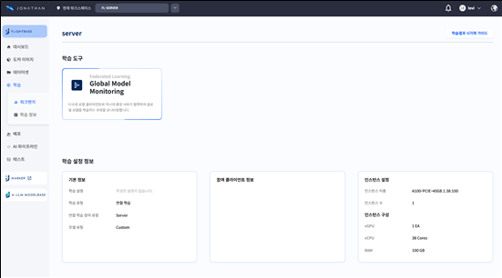

# Tango MSA 탑재 가이드

> 📌 **이 문서는 외부 협력 기관 개발자를 위한 기술 가이드입니다.** Tango GenAI 플랫폼 위에 자체 MSA 서비스를 배포하고 연동하는 전 과정을 단계별로 안내합니다.
> 

# 0. 시작하기 전에

## 0.1 Tango GenAI 플랫폼이란?

Tango GenAI 플랫폼은 아크릴에서 개발한 쿠버네티스(Kubernetes) 기반의 AI 서비스 운영 플랫폼입니다. 여러 AI 서비스 및 외부 애플리케이션을 하나의 플랫폼 위에서 통합 관리하고 실행할 수 있도록 설계되어 있습니다.

외부 협력 기관은 자체 개발한 서비스를 Tango 플랫폼에 **탑재(배포 및 연동)** 함으로써, 플랫폼의 인프라(GPU, 네트워크, 인증 등)를 활용하여 서비스를 운영할 수 있습니다.

## 0.2 이 문서의 목적

본 문서는 **외부 협력 기관의 개발자**가 자체 MSA 서비스를 Tango GenAI 플랫폼에 탑재할 수 있도록 필요한 절차와 구성 요건을 안내합니다.

구체적으로는 아래 세 가지를 다룹니다.

- Helm Chart 작성 방법 (서비스 배포 설정 파일 구성)
- Helm Chart를 이용한 쿠버네티스 클러스터 배포 방법
- 배포 후 GenAI 플랫폼과의 연동 상태 확인 방법

<aside>
💡

**MSA(Microservice Architecture) 서비스란?**

하나의 거대한 프로그램 대신, 기능별로 잘게 나눈 독립적인 작은 서비스들의 모음입니다. 예를 들어 "AI 추론", "데이터 전처리", "결과 시각화" 같은 기능을 각각 별도의 서비스로 만들고, 이를 필요에 따라 조합해서 사용하는 방식입니다.
이 문서에서 말하는 'MSA 서비스'는 **여러분이 독립적으로 개발한 하나의 프론트-백엔드 묶음의 서비스 단위**를 의미합니다. 이 서비스를 Docker 이미지로 만들어 Tango 플랫폼 위에 올리면, 플랫폼의 GPU·네트워크·인증 인프라를 그대로 활용할 수 있게 됩니다.

</aside>

## 0.3 대상 독자

이 문서는 다음에 해당하는 독자를 대상으로 합니다.

- Tango GenAI 플랫폼에 외부 서비스를 탑재하려는 협력 기관 개발자
- 기존 MSA 서비스를 쿠버네티스 환경으로 이전하려는 개발자

## 0.4 용어 정리

| 용어 | 설명 |
| --- | --- |
| **MSA** (Microservice Architecture) | 애플리케이션을 독립적으로 배포 가능한 소규모 서비스들로 분리하는 아키텍처 방식 |
| **탑재** | 외부 서비스를 Tango 플랫폼의 쿠버네티스 클러스터에 배포하고 플랫폼과 연동하는 행위 |
| **Helm Chart** | 쿠버네티스 애플리케이션을 정의·설치·관리하기 위한 패키지 형식. 일종의 배포 설정 템플릿 |
| **Kubernetes (k8s)** | 컨테이너화된 애플리케이션의 배포·확장·관리를 자동화하는 오픈소스 플랫폼 |
| **Ingress** | 클러스터 외부에서 내부 서비스로 HTTP/HTTPS 트래픽을 라우팅하는 쿠버네티스 리소스 |
| **Namespace** | 쿠버네티스 클러스터 내에서 리소스를 논리적으로 격리하는 단위 |

## 0.5 사전 요건

본 문서를 따라 진행하려면 아래 항목에 대한 기본적인 이해가 필요합니다.

- 쿠버네티스 클러스터 운영 환경 및 기본 리소스 개념 (Deployment, Service, Ingress 등)
- Helm Chart 구조 및 기본 사용법
- Docker 컨테이너 이미지 빌드 및 레지스트리 운용

---

# 1. 개요

## 1.1 적용 범위

본 문서는 다음 시나리오에 적용됩니다.

- Helm Chart를 신규 작성하여 MSA 서비스를 쿠버네티스 클러스터에 배포하는 경우
- 기 작성된 Helm Chart를 기반으로 GenAI 플랫폼과의 서비스 연동을 구성하는 경우

## 1.2 전체 흐름

탑재 작업은 아래 순서로 진행됩니다.

| 단계 | 내용 |
| --- | --- |
| **1단계** | Helm Chart 작성 — Chart 구조 정의 및 `values.yaml`, 템플릿 파일 구성 |
| **2단계** | Helm Chart 설치 — 플랫폼 연동을 위한 설치 명령어 구성 및 실행 |
| **3단계** | 실행 확인 — GenAI 플랫폼과의 연동 상태 및 동작 확인 |

## 1.3 탑재 시나리오

협력기관이 MSA 서비스를 Tango 플랫폼에 탑재하는 전형적인 흐름은 아래와 같습니다.

**① 서비스 개발 및 컨테이너화**

협력기관은 자체 서비스를 개발하고 Docker 이미지로 빌드합니다. 이 때 플랫폼이 호출할 `/health`, `/info`, `/run` 엔드포인트를 서비스 내에 반드시 구현해야 합니다. (5장 참고) 빌드한 이미지는 플랫폼이 접근 가능한 컨테이너 레지스트리(ex. Docker Hub)에 푸시합니다.

**② Helm Chart 작성**

서비스 배포에 필요한 Helm Chart를 작성합니다. 프론트엔드·백엔드 구성, 포트 설정, 리소스 요구사항 등을 `values.yaml`에 정의합니다. (2장 참고)

**③ 플랫폼 담당자와 사전 협의**

탑재 전 플랫폼 담당자에게 아래 정보를 전달하고 확인받습니다.

- 서비스 이름 및 설명
- 컨테이너 이미지 경로 및 레지스트리 접근 정보
- 필요한 리소스 (CPU, Memory, GPU 여부)
- `/run` 엔드포인트의 `params` / `result` 스키마

**④ Helm Chart 설치 (탑재)**

플랫폼 담당자 또는 협력기관이 직접 `helm install` 명령을 실행하여 서비스를 클러스터에 배포합니다. (3장 참고)

**⑤ 연동 확인**

배포 후 플랫폼이 `/health`를 통해 서비스 상태를 확인하고, `/info`로 서비스 정보를 조회합니다. 정상 확인 후 플랫폼 UI에서 서비스가 노출됩니다. (4장 참고)

> 💡 **참고:** 현재는 탑재 과정 일부를 수동으로 진행해야 합니다. 향후 플랫폼 UI를 통한 탑재 및 테스트 기능을 지원할 예정입니다.
> 

---

# 2. Helm Chart 작성

## 2.1 Helm 설치 및 Chart 탬플릿 생성

Helm CLI가 설치되어 있지 않다면 설치합니다.

```bash
# 다운로드 후 설치
curl -fsSL -o get_helm.sh https://raw.githubusercontent.com/helm/helm/main/scripts/get-helm-3
chmod +x get_helm.sh
./get_helm.sh
rm get_helm.sh

# 자동완성 추가 (exec bash로 배시 리로드, source /etc/profile.d/bash_completion.sh로 자동완성 리로드)
helm completion bash > /etc/bash_completion.d/helm
source /etc/profile.d/bash_completion.sh

# 설치 확인
helm version
```

Helm CLI가 설치되어 있다면, `helm create <chart_name>` 명령을 실행하여 새로운 차트를 생성할 수 있습니다.

```markdown
<chart_name>
├── Chart.yaml
├── values.yaml
├── charts
└── templates
    ├── NOTES.txt
    ├── _helpers.tpl
    ├── deployment.yaml
    ├── hpa.yaml
    ├── ingress.yaml
    ├── service.yaml
    ├── serviceaccount.yaml
    └── tests
        └── test-connection.yaml
```

세부적인 Helm chart의 사용법이나 작성법은 Helm 공식 사이트에서 제공하는 가이드가 있으며, 필요한 경우 인터넷 검색을 활용하면 됩니다.

## 2.2 MSA Helm Chart

```markdown
* MSA 서비스의 기본적인 Helm Chart의 구조 **
helm_chart/
├── Chart.yaml ← Helm Chart description (이름, 버전 및 설명과 같은 차트에 대한 메타데이터)
├── values.yaml ← 차트 설치 시 실제로 사용하는 기본 구성 값
└── templates ← 실제 helm install 시 참조하는 영역
    ├── deployment.yaml ← 쿠버네티스의 pod와 replicaset 에 대한 업데이트 정의
    ├── ingress.yaml ← ingress controller를 통한 http, https 경로 노출
    └── service.yaml ← deployment를 통해 생성된 pod에 논리적으로 접근할 수 있는 추상화 인터페이스
```

### values.yaml

아래는 프론트엔드 1개 + 백엔드 1개로 구성된 최소 예시입니다. 서비스 구성에 따라 프론트엔드를 추가하거나, 백엔드를 여러 개로 분리할 수 있습니다.

```yaml
# ── 메타데이터 (helm install 시 --set 으로 주입) ──
metadata:
  namespace: ""          # 배포 대상 네임스페이스
  workspace_id: ""
  project_id: ""
  pod_name: ""

labels:
  helm_name: ""
  workspace_id: ""
  project_id: ""

# ── 서비스(포트) 설정 ──
service:
  frontend:
    port: 80              # 클러스터 내부 접근 포트
    targetPort: 80        # 컨테이너 내부 애플리케이션 포트
    nodePort: 30000       # 클러스터 외부 접속 포트 (30000-32767)
  backend:
    port: 8000
    targetPort: 8000
    nodePort: 30001

# ── Ingress 설정 ──
ingress:
  enabled: true
  className: "jonathan-kong"

# ── 프론트엔드 Pod 설정 ──
frontend:
  enabled: true
  image: "your-registry/your-frontend:latest"   # 도커 이미지 경로
  imagePullPolicy: "IfNotPresent"                # Always | IfNotPresent
  port: 80
  resources:
    limits:   { cpu: "500m",  memory: "512Mi" }
    requests: { cpu: "100m",  memory: "128Mi" }

# ── 백엔드 Pod 설정 ──
backend:
  enabled: true
  image: "your-registry/your-backend:latest"
  imagePullPolicy: "Always"
  port: 8000
  resources:
    limits:   { cpu: "8",  memory: "16Gi", gpu: 1 }   # GPU가 불필요하면 gpu 항목 제거
    requests: { cpu: "8",  memory: "16Gi", gpu: 1 }
```

values.yaml에 정의된 value 값들을 아래 탬플릿에서 `{{ .Values.metadata.pod_name }}` 같은 형식으로 탬플릿에서 참조합니다

### templates/deployment.yaml

아래는 프론트엔드와 백엔드 각 1개의 Deployment를 정의하는 최소 예시입니다. 서비스가 여러 개의 프론트엔드/백엔드로 구성되는 경우, 동일한 패턴을 반복하여 추가하면 됩니다.

```yaml
# ── 프론트엔드 Deployment ──
{{- if .Values.frontend.enabled }}
apiVersion: apps/v1
kind: Deployment
metadata:
  name: {{ .Values.metadata.pod_name }}-frontend
  namespace: {{ .Values.metadata.namespace }}
  labels:
    app: {{ .Values.labels.helm_name }}-frontend
spec:
  replicas: 1
  selector:
    matchLabels:
      app: {{ .Values.labels.helm_name }}-frontend
  template:
    metadata:
      labels:
        app: {{ .Values.labels.helm_name }}-frontend
      annotations:
        acryl.ai/appType: user       # Tango 플랫폼 필수 어노테이션
    spec:
      containers:
      - name: frontend
        image: {{ .Values.frontend.image }}
        imagePullPolicy: {{ .Values.frontend.imagePullPolicy }}
        ports:
        - containerPort: {{ .Values.frontend.port }}
        resources:
          limits:   { cpu: {{ .Values.frontend.resources.limits.cpu }},   memory: {{ .Values.frontend.resources.limits.memory }} }
          requests: { cpu: {{ .Values.frontend.resources.requests.cpu }}, memory: {{ .Values.frontend.resources.requests.memory }} }
{{- end }}
---
# ── 백엔드 Deployment ──
{{- if .Values.backend.enabled }}
apiVersion: apps/v1
kind: Deployment
metadata:
  name: {{ .Values.metadata.pod_name }}-backend
  namespace: {{ .Values.metadata.namespace }}
  labels:
    app: {{ .Values.labels.helm_name }}-backend
spec:
  replicas: 1
  selector:
    matchLabels:
      app: {{ .Values.labels.helm_name }}-backend
  template:
    metadata:
      labels:
        app: {{ .Values.labels.helm_name }}-backend
      annotations:
        acryl.ai/appType: user
    spec:
      containers:
      - name: backend
        image: {{ .Values.backend.image }}
        imagePullPolicy: {{ .Values.backend.imagePullPolicy }}
        ports:
        - containerPort: {{ .Values.backend.port }}
        resources:
          limits:
            cpu: {{ .Values.backend.resources.limits.cpu }}
            memory: {{ .Values.backend.resources.limits.memory }}
            nvidia.com/gpu: {{ .Values.backend.resources.limits.gpu }}   # GPU 불필요 시 제거
          requests:
            cpu: {{ .Values.backend.resources.requests.cpu }}
            memory: {{ .Values.backend.resources.requests.memory }}
            nvidia.com/gpu: {{ .Values.backend.resources.requests.gpu }}
{{- end }}
```

> 💡 **필요에 따라 추가할 수 있는 항목:** `env` (환경변수), `command` (초기 실행 명령), `volumeMounts` / `volumes` (볼륨 마운트), `securityContext` (보안 설정) 등을 각 컨테이너 스펙에 추가할 수 있습니다.
> 

> ❗ **필수 어노테이션: `acryl.ai/appType: user`**
> 

> 모든 Deployment의 `template.metadata.annotations`에 `acryl.ai/appType: user`를 반드시 포함해야 합니다. Tango 플랫폼은 이 어노테이션을 통해 클러스터 내의 사용자 배포 서비스를 식별하고, 플랫폼 UI에 노출하며, 리소스 모니터링 대상에 포함합니다. 이 어노테이션이 누락되면 플랫폼에서 서비스를 인식하지 못합니다.
> 

### templates/ingress.yaml

```yaml
{{- if .Values.ingress.enabled }}
apiVersion: networking.k8s.io/v1
kind: Ingress
metadata:
  name: {{ .Values.metadata.pod_name }}-ingress
  namespace: {{ .Values.metadata.namespace }}
  annotations:
    konghq.com/preserve-host: "false"
spec:
  ingressClassName: {{ .Values.ingress.className }}
  rules:
  - http:
      paths:
      - path: /msa/<서비스명>          # 아래 네이밍 규칙 참고
        pathType: Prefix
        backend:
          service:
            name: {{ .Values.metadata.pod_name }}-backend-svc
            port:
              number: {{ .Values.service.backend.port }}
{{- end }}
```

> 📌 **Ingress 경로 네이밍 규칙**
> 
> 
> Ingress path는 다음 규칙을 따릅니다. 플랫폼 담당자와 사전 협의 후 확정합니다.
> 
> • 형식: `/msa/<서비스명>` (ex: `/msa/fl-server`, `/msa/data-labeling`)
> 
> • 서비스명은 **소문자 + 하이픈 구분**(kebab-case)으로 작성 (ex: `my-ai-service`)
> 
> • 플랫폼 내 다른 서비스와 경로가 충돌하지 않도록 담당자와 반드시 확인합니다.
> 

### templates/service.yaml

```yaml
# ── 프론트엔드 Service ──
{{- if .Values.frontend.enabled }}
apiVersion: v1
kind: Service
metadata:
  name: {{ .Values.metadata.pod_name }}-frontend-svc
  namespace: {{ .Values.metadata.namespace }}
spec:
  type: NodePort
  ports:
  - port: {{ .Values.service.frontend.port }}
    targetPort: {{ .Values.service.frontend.targetPort }}
    nodePort: {{ .Values.service.frontend.nodePort }}
    protocol: TCP
  selector:
    app: {{ .Values.labels.helm_name }}-frontend
{{- end }}
---
# ── 백엔드 Service ──
{{- if .Values.backend.enabled }}
apiVersion: v1
kind: Service
metadata:
  name: {{ .Values.metadata.pod_name }}-backend-svc
  namespace: {{ .Values.metadata.namespace }}
spec:
  type: NodePort
  ports:
  - port: {{ .Values.service.backend.port }}
    targetPort: {{ .Values.service.backend.targetPort }}
    nodePort: {{ .Values.service.backend.nodePort }}
    protocol: TCP
  selector:
    app: {{ .Values.labels.helm_name }}-backend
{{- end }}
```

위의 예시와 같이 helm chart 탬플릿을 정의합니다.

---

# 3. Helm Chart 설치

앞서 정의한 Helm Chart 탬플릿을 이용하여, `helm install` 명령으로 MSA 서비스를 쿠버네티스 클러스터에 배포합니다.

### 3.1 기본 설치 명령

```bash
helm install <릴리스명> ./<chart_디렉토리>/ \
  -n <네임스페이스> --create-namespace \
  --set metadata.namespace=<네임스페이스> \
  --set metadata.workspace_id=<워크스페이스_ID> \
  --set metadata.project_id=<프로젝트_ID> \
  --set metadata.pod_name=<Pod_이름> \
  --set labels.helm_name=<릴리스명> \
  --set ingress.enabled=true
```

`--set` 플래그를 사용하면 `values.yaml`에 정의된 기본값을 설치 시점에 동적으로 덮어쓸 수 있습니다. 위 명령은 최소 필수 파라미터만 포함한 예시이며, 서비스에 따라 `--set` 항목을 추가할 수 있습니다.

### 3.2 애플리케이션 코드에서 설치하는 예시 (Python)

서비스 로직 내에서 Helm 설치를 자동화하려는 경우, 아래와 같이 서브프로세스로 실행할 수 있습니다.

```python
import asyncio

async def install_msa_service(release_name: str, namespace: str, chart_path: str, values: dict):
    """
    Helm Chart를 이용해 MSA 서비스를 설치합니다.
    :param release_name: Helm 릴리스 이름 (ex: "my-service-1")
    :param namespace:    배포 대상 네임스페이스
    :param chart_path:   Helm Chart 디렉토리 경로
    :param values:       --set 으로 전달할 값들 {"key": "value"}
    """
    set_flags = " ".join(f'--set {k}={v}' for k, v in values.items())

    command = (
        f"helm install {release_name} {chart_path}/ "
        f"-n {namespace} --create-namespace "
        f"{set_flags}"
    )

    process = await asyncio.create_subprocess_shell(
        command,
        stdout=asyncio.subprocess.PIPE,
        stderr=asyncio.subprocess.PIPE,
    )
    stdout, stderr = await process.communicate()

    if process.returncode != 0:
        raise RuntimeError(f"Helm install failed: {stderr.decode().strip()}")

    print(f"Installed successfully: {stdout.decode().strip()}")
```

> 💡 **참고:** 설치한 MSA 서비스는 사용자가 종료하지 않는 한 계속 실행됩니다. 서비스를 종료하려면 `helm uninstall <릴리스명> -n <네임스페이스>` 명령을 사용합니다. Pod을 수동으로 종료하는 방법도 있으나 번거로우므로, 삭제 유틸 함수를 미리 만들어두는 것을 권장합니다.
> 

---

# 4. 실행 확인

MSA 서비스를 Helm Chart를 이용해 설치하는데 성공했다면, GenAI Platform에서 연동된 서비스가 제대로 동작하는지 확인합니다.

> ⚠️ **현재는 외부 MSA 서비스 연동을 위한 별도의 UI가 존재하지 않으나 추후 지원할 예정입니다.**
> 

아래 화면들은 앞의 과정들을 통해 설치한 MSA 서비스와 GenAI Platform를 연동하여, MSA 서비스가 GenAI Platform 위에서 정상적으로 동작하고 있음을 보여주는 예시입니다.



MSA 서비스와 GenAI Platform 이 서로 통신하며 데이터를 주고받는 모습입니다 (서비스의 동작 상태, 노드 정보 등)


실행중인 MSA 서비스에 진입하여 서비스 동작을 확인하는 화면입니다.


위 화면은 예시 화면으로, GenAI Platform에서 학습한 모델을 타겟 디바이스(엣지 NPU를 탑재한 FPGA 보드)에 전송하여 연합학습을 수행하는 모습입니다.

# 5. API 인터페이스 명세

## 5.1 개요

> 🚧 **본 API 명세는 초안(Draft)입니다.**
인증 방식, 공통 헤더, 엔드포인트 스펙 등 모든 항목은 플랫폼 개발 진행에 따라 변경될 수 있습니다. **명세가 변경되는 경우 업데이트된 문서를 별도로 공유할 예정입니다.**
> 

Tango GenAI 플랫폼은 탑재된 MSA 서비스를 직접 호출합니다. 따라서 **협력기관은 자신의 서비스에 아래 엔드포인트를 반드시 구현해야 합니다.**

모든 엔드포인트는 Helm Chart의 `ingress.yaml`에 설정된 경로(`/federated/{서비스명}`) 하위에 위치합니다.

> ⚠️ **인증 방식(Authentication)은 현재 미정입니다.** API Key 또는 JWT 토큰 방식이 검토 중이며, 확정되는 대로 본 문서에 업데이트됩니다. 현재는 클러스터 내부 네트워크 신뢰를 기반으로 운영합니다.
> 

---

## 5.2 공통 요청 헤더

플랫폼이 MSA 서비스를 호출할 때 아래 헤더를 공통으로 전달합니다.

| 헤더 | 타입 | 설명 |
| --- | --- | --- |
| `X-Workspace-Id` | string | 요청을 발생시킨 워크스페이스 ID |
| `X-Project-Id` | string | 요청을 발생시킨 프로젝트 ID |
| `X-User-Token` | string | 사용자 인증 토큰 (형식 추후 확정) |
| `X-Resource-Gpu` | string | 할당된 GPU 수 (예: `"1"`) |
| `X-Resource-Cpu` | string | 할당된 CPU 수 (예: `"8"`) |
| `X-Resource-Memory` | string | 할당된 메모리 (예: `"16Gi"`) |

---

## 5.3 필수 엔드포인트

협력기관은 아래 **3개 엔드포인트를 반드시 구현**해야 합니다.

### [1] 헬스 체크

플랫폼이 서비스의 정상 동작 여부를 주기적으로 확인합니다. 서비스가 기동되면 이 엔드포인트가 `200 OK`를 반환할 수 있어야 합니다.

```
GET /health
```

**Response**

```json
// 200 OK
{
  "status": "healthy",
  "timestamp": "2026-03-09T03:00:00Z"
}
```

| 필드 | 타입 | 설명 |
| --- | --- | --- |
| `status` | string | 서비스 상태. 정상 시 `"healthy"` 반환 |
| `timestamp` | string (ISO 8601) | 응답 생성 시각 |

---

### [2] 서비스 메타정보 조회

플랫폼 UI에서 탑재된 서비스의 이름, 버전, 기능 목록 등을 표시할 때 호출합니다.

```
GET /info
```

**Response**

```json
// 200 OK
{
  "name": "my-service",
  "version": "1.0.0",
  "description": "서비스에 대한 간략한 설명",
  "capabilities": ["feature_a", "feature_b"]
}
```

| 필드 | 타입 | 설명 |
| --- | --- | --- |
| `name` | string | 서비스 식별자 이름 |
| `version` | string | 서비스 버전 |
| `description` | string | 서비스 설명 |
| `capabilities` | array of string | 서비스가 제공하는 기능 목록 |

---

### [3] 서비스 실행

플랫폼이 서비스의 주요 기능을 실행할 때 호출합니다. **기본적으로 동기 방식**으로 동작하며, 실행 결과를 즉시 반환해야 합니다.

> ⚠️ **타임아웃 정책:** 플랫폼은 `/run` 호출 시 **기본 60초** 타임아웃을 적용합니다 (정확한 값은 추후 확정). 이 시간 내에 응답을 반환하지 못하면 플랫폼은 타임아웃 오류로 처리합니다.

실행 시간이 60초를 초과할 수 있는 작업(예: 모델 학습, 대규모 데이터 처리)의 경우, **비동기 패턴**을 권장합니다:
1. `/run` 호출 시 작업을 시작하고 `job_id`를 즉시 반환
2. 플랫폼이 `/status?job_id=xxx`로 진행 상태를 폴링
3. 완료 시 결과를 반환

비동기 처리가 필요한 경우 플랫폼 담당자와 협의하여 `/status` 엔드포인트를 추가로 정의하세요. (5.4 이후의 "추가 API가 필요한 경우" 안내 참고)
> 

```
POST /run
```

**Request Body**

```json
{
  "workspace_id": "ws-123",
  "project_id": "proj-456",
  "params": {
    // 서비스별 자유 파라미터 (협력기관이 정의)
  }
}
```

| 필드 | 타입 | 필수 | 설명 |
| --- | --- | --- | --- |
| `workspace_id` | string | ✅ | 요청 워크스페이스 ID |
| `project_id` | string | ✅ | 요청 프로젝트 ID |
| `params` | object | ✅ | 서비스별 실행 파라미터 (협력기관이 자유롭게 정의) |

**Response**

```json
// 200 OK — 실행 성공
{
  "status": "success",
  "result": {
    // 서비스별 결과 (협력기관이 정의)
  }
}

// 400 Bad Request — 파라미터 오류
{
  "status": "error",
  "code": "INVALID_PARAMS",
  "message": "오류 설명"
}

// 500 Internal Server Error — 서비스 내부 오류
{
  "status": "error",
  "code": "INTERNAL_ERROR",
  "message": "오류 설명"
}
```

| 필드 | 타입 | 설명 |
| --- | --- | --- |
| `status` | string | `"success"` 또는 `"error"` |
| `result` | object | 실행 결과 (성공 시, 서비스별로 자유롭게 정의) |
| `code` | string | 에러 코드 (실패 시) |
| `message` | string | 에러 설명 (실패 시) |

---

## 5.4 표준 에러 코드

플랫폼이 에러 응답을 일관되게 처리할 수 있도록, 아래 표준 에러 코드를 사용합니다. 협력기관은 서비스 특성에 맞는 에러 코드를 추가할 수 있으며, 추가 시 플랫폼 담당자와 협의합니다.

| 에러 코드 | HTTP 상태 | 설명 |
| --- | --- | --- |
| `INVALID_PARAMS` | 400 | 필수 파라미터 누락 또는 형식 오류 |
| `UNAUTHORIZED` | 401 | 인증 토큰 누락 또는 유효하지 않음 |
| `FORBIDDEN` | 403 | 해당 작업에 대한 권한 없음 |
| `NOT_FOUND` | 404 | 요청한 리소스를 찾을 수 없음 |
| `TIMEOUT` | 408 | 작업 처리 시간 초과 |
| `RESOURCE_EXHAUSTED` | 429 | GPU/CPU/메모리 등 리소스 부족 |
| `INTERNAL_ERROR` | 500 | 서비스 내부 오류 (예기치 않은 예외) |
| `SERVICE_UNAVAILABLE` | 503 | 서비스 일시적 사용 불가 (초기화 중 등) |

---

## 5.5 엔드포인트 요약

| 엔드포인트 | 메서드 | 필수 여부 | 설명 |
| --- | --- | --- | --- |
| `/health` | GET | ✅ 필수 | 서비스 상태 확인 |
| `/info` | GET | ✅ 필수 | 서비스 메타정보 조회 |
| `/run` | POST | ✅ 필수 | 서비스 실행 (동기) |

> 💡 **참고:** `params` 및 `result` 의 상세 스키마는 서비스마다 다를 수 있습니다. 협력기관은 자신의 서비스에 맞게 자유롭게 정의하되, 플랫폼 담당자와 사전 협의하여 확정하는 것을 권장합니다.
> 

---

<aside>
💡

📋 **API 인터페이스 정의 절차 안내**

**플랫폼이 정하는 표준 인터페이스** — `/health`, `/info`, `/run` 엔드포인트의 기본 구조와 공통 요청 헤더는 Tango 플랫폼이 정의한 표준입니다. 모든 협력기관은 자신의 서비스에 맞게 자유롭게 인터페이스를 정의하되, 아크릴 내 플랫폼 담당자와 사전 협의하여 확정하는 것을 권장합니다.

**협력기관이 정의하는 부분** — `/run`의 `params`(입력 파라미터)와 `result`(실행 결과) 스키마는 서비스의 특성에 따라 협력기관이 직접 설계합니다.

**확정 절차는 아래 순서로 진행합니다.**

1. 협력기관이 자신의 서비스에 맞는 `params` / `result` 스키마 초안을 작성합니다.
2. 플랫폼 담당자에게 초안을 전달하여 검토를 요청합니다.
3. 플랫폼 담당자와 협의 후 스키마를 확정합니다.
4. 확정된 스키마를 기반으로 양측이 각자의 연동 코드를 개발합니다.

⚠️ 스키마가 확정되기 전이라도, 기본 엔드포인트 구조(`/health`, `/info`, `/run`)는 미리 구현해두고 Docker 이미지 빌드까지 진행할 수 있습니다. `params`와 `result`는 확정 후 채워넣는 방식으로 단계적으로 개발하는 것을 권장합니다.

</aside>

---

<aside>
📎

**추가 API가 필요한 경우**

서비스 특성에 따라 `/health`, `/info`, `/run` 외에 플랫폼이 추가로 호출해야 할 엔드포인트가 필요할 수 있습니다.

이 경우 **협력기관이 해당 API의 명세를 작성하여 플랫폼 담당자에게 전달**해 주세요. 플랫폼이 협력기관 서비스를 호출하는 방향이므로, 서비스를 가장 잘 아는 협력기관이 먼저 명세를 제안하고 플랫폼 담당자가 검토·확정하는 방식으로 진행합니다.

전달 시 아래 항목을 포함해 주세요.

- 엔드포인트 경로 및 HTTP 메서드
- Request Body / Query Parameter 구조
- Response 구조 및 각 필드 설명
- 해당 API의 호출 목적 (언제, 왜 플랫폼이 이 API를 호출해야 하는지)

아래는 명세 작성 예시입니다. 이 형식을 참고하여 작성해 주세요.

**[예시] 학습 상태 조회**

```
GET /status
```

호출 목적: 플랫폼이 서비스의 현재 학습 진행 상태를 주기적으로 조회할 때 사용합니다.

Query Parameters

| 파라미터 | 타입 | 필수 | 설명 |
| --- | --- | --- | --- |
| `job_id` | string | ✅ | 조회할 작업의 고유 ID |

Response (200 OK)

```json
{
  "job_id": "job-abc123",
  "status": "running",       // "pending" | "running" | "completed" | "failed"
  "progress": 42,            // 진행률 (0~100)
  "message": "epoch 3/10 완료" // 현재 상태 설명 (선택)
}
```

Response (400 Bad Request)

```json
{
  "code": "JOB_NOT_FOUND",
  "message": "해당 job_id를 찾을 수 없습니다."
}
```

**FastAPI 구현 예시 (skeleton)**

```python
from fastapi import FastAPI, HTTPException
from pydantic import BaseModel

app = FastAPI()

# 작업 상태를 저장하는 in-memory 저장소
# 실제 구현 시 DB 또는 큐로 대체하세요
job_store: dict = {}

class StatusResponse(BaseModel):
    job_id: str
    status: str        # "pending" | "running" | "completed" | "failed"
    progress: int      # 0~100
    message: str | None = None

@app.get("/status", response_model=StatusResponse)
def get_status(job_id: str):
    """
    플랫폼이 작업 진행 상태를 조회할 때 호출합니다.
    job_id: /run 호출 시 발급된 작업 고유 ID
    """
    if job_id not in job_store:
        raise HTTPException(
            status_code=400,
            detail={
                "code": "JOB_NOT_FOUND",
                "message": "해당 job_id를 찾을 수 없습니다."
            }
        )

    job = job_store[job_id]
    return StatusResponse(
        job_id=job_id,
        status=job["status"],
        progress=job["progress"],
        message=job.get("message")
    )
```

</aside>
