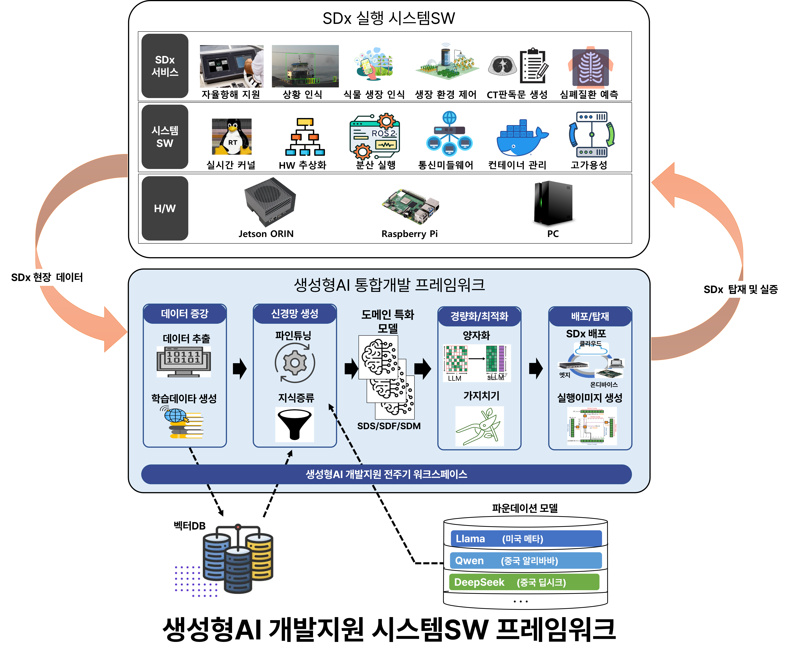
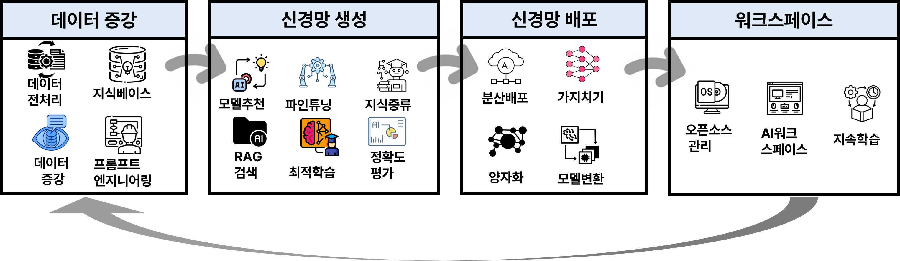
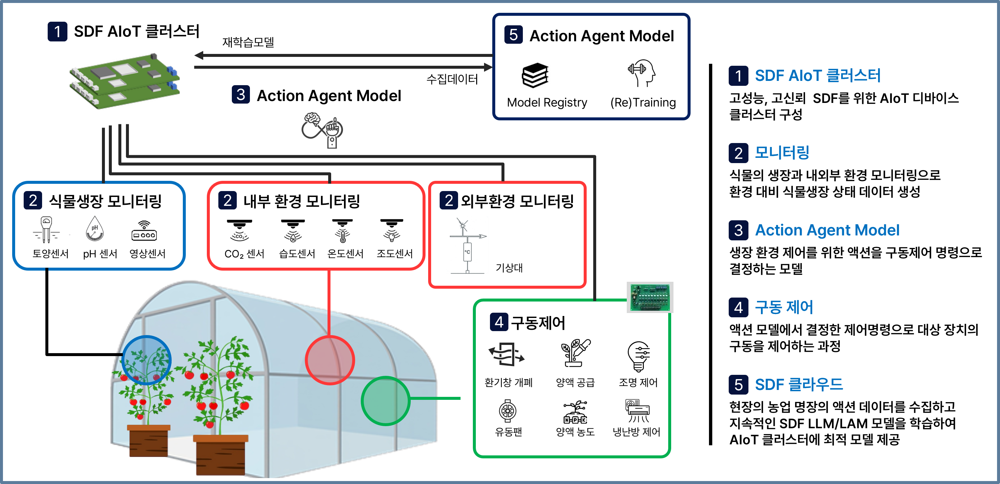
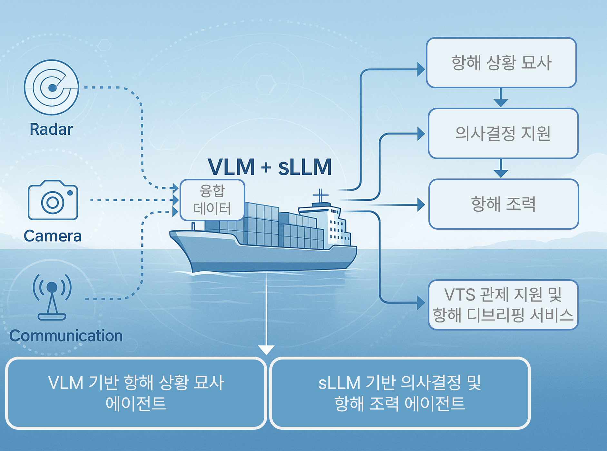
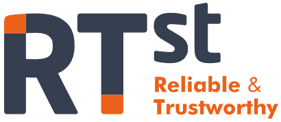
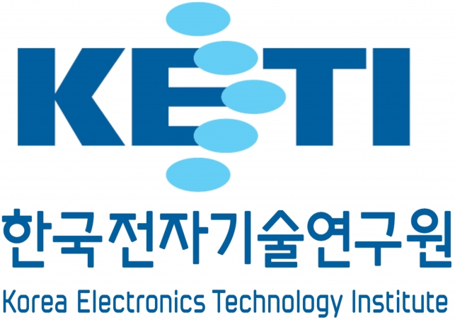
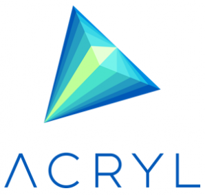
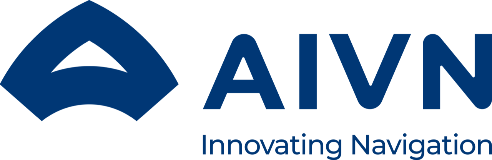

# [**2025 4th TANGO Community Conference**](http://tangoai.or.kr)
* [**STCenter** (과학기술컨벤션센터 / 한국과학기술회관)](https://www.stcenter.or.kr/)
* [**B1F, 22, Teheran-ro 7-gil, Gangnam-gu, Seoul, Republic of Korea** \
(서울시 강남구 테헤란로 7길 22, 과학기술회관 대회의실1)](https://www.google.com/maps/place/%ED%95%9C%EA%B5%AD%EA%B3%BC%ED%95%99%EA%B8%B0%EC%88%A0%ED%9A%8C%EA%B4%80/data=!4m15!1m8!3m7!1s0x357ca157ddbed32f:0x29432bdf4b90af3d!2z7ISc7Jq47Yq567OE7IucIOqwleuCqOq1rCDthYztl6TrnoDroZw36ri4IDIy!3b1!8m2!3d37.500961!4d127.0306229!16s%2Fg%2F11bzn06m8v!3m5!1s0x357ca157de00cbb3:0xe5266ee55f1d179e!8m2!3d37.5007029!4d127.0307453!16s%2Fg%2F1tf8508h?entry=ttu&g_ep=EgoyMDI1MTAxNC4wIKXMDSoASAFQAw%3D%3D)
* **2025-11-06 / 13:30~17:30**

---

# **TANGO 2**

This is the official repository for the TANGO 2 project. 
TANGO (**T**arget **A**ware **N**o-code neural network **G**eneration and **O**peration framework) is code name of project for Integrated Machine Learning Framework.

<p align="center">
    
</p>

It aims to develop automatic neural network generation and deployment framework that helps novice users to easily develop neural network applications with less or ideally no code efforts and deploy the neural network application onto the target device.

TANGO 2 is a follow-up project to [**TANGO**](https://github.com/ML-TANGO/TANGO), an automatic neural network generation and deployment framework, and aims to provide a proof-of-concept for the SDx industry.

---

## Specification

<p align="center">
</p>

This repository is a collection of individual modules that satisfy the overall workflow as illustrated in the above figure.

The source tree is organized with the MSA (microservice architecture) principles: each subdirectory contains component container source code. 
Due to the separation of source directory, component container developers just only work on their own isolated subdirectory and publish minimal REST API to serve project manager container's service request.

```bash
TANGO2
   ├── Data_Augmentation
   │   └── fewshot_prompting 
   │
   ├── Deployment
   │   ├── Optimization
   │   └── Runtime_Engine
   │       ├── Timestamp
   │       ├── kernel_source
   │       └── monitoring
   │
   ├── GenAI_Platform
   │
   ├── Learning
   │   └── Intent_Detection
   │
   ├── SDF
   │
   ├── SDM
   │
   └── SDS
       ├── Data_Revision
       ├── dataset
       └── simulator
```

### Data_Augmentation
[[View Details]](Data_Augmentation/README.md)

└── fewshot_prompting [[View Details]](Data_Augmentation/fewshot_prompting/README.md)


### Deployment
[[View Details]](Deployment/README.md)

├── Optimization [[View Details]](Deployment/Optimization/README.md)

└── Runtime_Engine [[View Details]](Deployment/Runtime_Engine/README.md)

&nbsp;&nbsp;&nbsp;&nbsp;&nbsp;&nbsp;&nbsp;&nbsp;&nbsp;├── Timestamp [[View Details]](Deployment/Runtime_Engine/Timestamp/README.md)

&nbsp;&nbsp;&nbsp;&nbsp;&nbsp;&nbsp;&nbsp;&nbsp;&nbsp;├── kernel_source [[View Details]](Deployment/Runtime_Engine/kernel_source/README.md)

&nbsp;&nbsp;&nbsp;&nbsp;&nbsp;&nbsp;&nbsp;&nbsp;&nbsp;└── monitoring [[View Details]](Deployment/Runtime_Engine/monitoring/README.md)


### GenAI_Platform 
[[View Details]](GenAI_Platform/README.md)


### Learning 
[[View Details]](Learning/README.md)

└── Intent_Detection [View Details]


### SDF 
[[View Details]](SDF/README.md)

<p align="center">
</p>

**Software Defined Farming**: To advance smart farms, we are building a system based on artificial intelligence (LLM, LAM) and verifying intelligent SDF through continuous learning of AI models.

### SDM
[[View Details]](SDM/README.md)

<p align="center">
</p>

**Software Defined Medicine**: We developed a Software Defined Medicine (SDM) system based on a medical domain-specific, multimodal (chest CT-interpretation) artificial intelligence (Large Vision-Language Model) and demonstrated it in a hospital.

### SDS 
[[View Details]](SDS/README.md)

├── Data_Revision [View Details]

├── dataset [[View Details]](SDS/dataset/README.md) [[View Details]](SDS/dataset/20250922/README.md)

└── simulator [[View Details]](SDS/simulator/README.md)

<p align="center">
</p>

**Software Defined Ship**: Going beyond the development of perception-centered AI agents using existing sensor fusion technology, we demonstrate that they understand and describe situations based on detected surrounding objects and environmental information, and make navigation decisions appropriate to the situation based on navigation rules.
  
---

#### Acknowledgement <a name="ack"></a>

This proejct was supported by [_Institute of Information & Communications Technology Planning & Evaluation (IITP)_](https://www.iitp.kr/) grant funded by the [_Ministry of Science and Information Communication Technology (MSIT)_](https://www.msit.go.kr/), Republic of Korea (**No. RS-2025-25442867**, _Development of a Generative AI-Supported System Software Framework for Optimal Execution of SDx Intelligent Services_).

---

<p align="center">  
    <a href="https://www.etri.re.kr/kor/main/main.etri">
        </a>
    <a href="https://www.tta.or.kr/tta/index.do">
        </a>
</p>

<p align="center">
    <a href="https://www.rtst.co.kr/">
        </a>
    <a href="https://www.keti.re.kr/main/main.php">
        </a>
    <a href="https://www.acryl.ai/kr/">
        </a>
    <a href="https://slpl.korea.ac.kr/">
        </a>
    <a href="https://aivenautics.com/">
        </a>
    <a href="https://suredatalab.com/site/">
        </a>
    <a href="https://www.snuh.org/intro.do">
        </a>
</p> 

---
