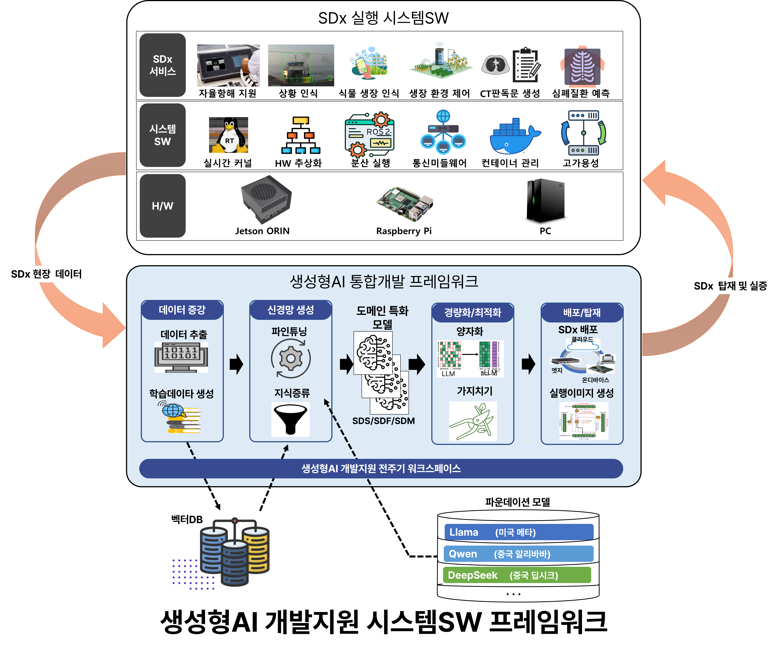
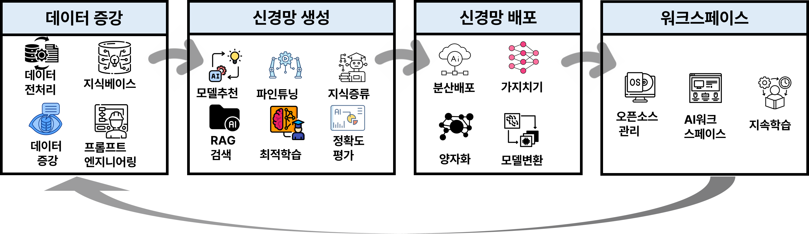
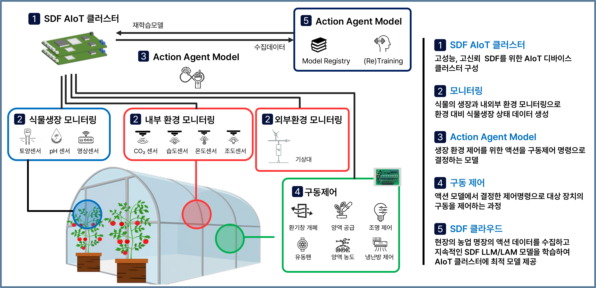
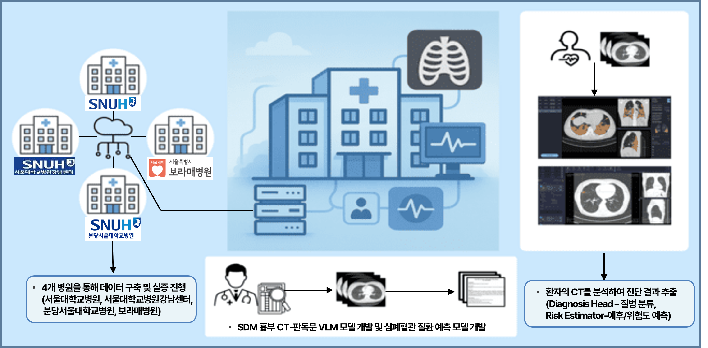
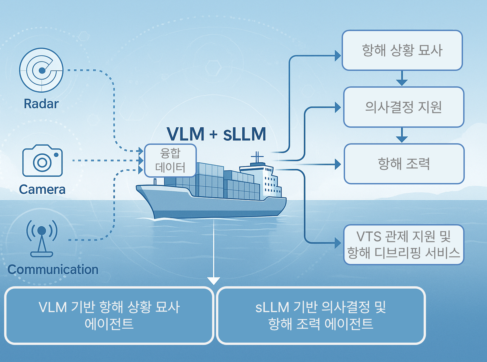
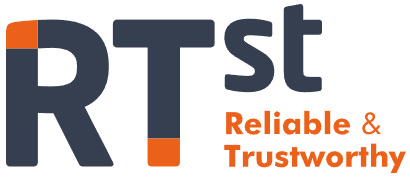
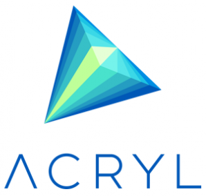

<!-- # [**2025 4th TANGO Community Conference**](http://tangoai.or.kr)
* [**STCenter** (과학기술컨벤션센터 / 한국과학기술회관)](https://www.stcenter.or.kr/)
* [**B1F, 22, Teheran-ro 7-gil, Gangnam-gu, Seoul, Republic of Korea** \
(서울시 강남구 테헤란로 7길 22, 과학기술회관 대회의실1)](https://www.google.com/maps/place/%ED%95%9C%EA%B5%AD%EA%B3%BC%ED%95%99%EA%B8%B0%EC%88%A0%ED%9A%8C%EA%B4%80/data=!4m15!1m8!3m7!1s0x357ca157ddbed32f:0x29432bdf4b90af3d!2z7ISc7Jq47Yq567OE7IucIOqwleuCqOq1rCDthYztl6TrnoDroZw36ri4IDIy!3b1!8m2!3d37.500961!4d127.0306229!16s%2Fg%2F11bzn06m8v!3m5!1s0x357ca157de00cbb3:0xe5266ee55f1d179e!8m2!3d37.5007029!4d127.0307453!16s%2Fg%2F1tf8508h?entry=ttu&g_ep=EgoyMDI1MTAxNC4wIKXMDSoASAFQAw%3D%3D)
* **2025-11-06 / 13:30~17:30**

--- -->

# **TANGO 2**

This is the official repository for the **TANGO 2** project. 
**TANGO** (**T**arget **A**ware **N**o-code neural network **G**eneration and **O**peration framework) is code name of project for Integrated Machine Learning Framework.

<p align="center">
    
</p>

It aims to develop automatic neural network generation and deployment framework that helps novice users to easily develop neural network applications with less or ideally no code efforts and deploy the neural network application onto the target device.

**TANGO 2** is a follow-up project to [**TANGO**](https://github.com/ML-TANGO/TANGO), an automatic neural network generation and deployment framework, and aims to provide a proof-of-concept for the SDx industry.

---

## Project Layout

<p align="center">
</p>

This repository is a collection of individual modules that satisfy the overall workflow as illustrated in the above figure. The source tree is organized into three top-level pillars, each with its own architectural style:

- **LLMOps** — the core TANGO 2 platform, organized along **MSA (microservice architecture)** principles. Each subdirectory under `apps/` contains an isolated component container with a minimal REST API; component developers work only inside their own subdirectory and publish APIs that the platform orchestrates.
- **Field_Test** — domain field demonstrations (SDF, SDM, SDS). These are proof-of-concept codebases that exercise the platform in real industry settings.
- **Runtime_System** — edge / on-device runtime components (optimization, parallel inference, runtime engine, remote node management) that sit outside the platform cluster and target deployment hardware.

### Where to start

- **Install or deploy the platform** - See [`LLMOps/devops/INSTALL.md`](LLMOps/devops/INSTALL.md) (Kubernetes Helm charts and install scripts).
- **Explore a domain demonstration** - See the per-domain READMEs under [`Field_Test/`](Field_Test) — [SDF](Field_Test/SDF/README.md), [SDM](Field_Test/SDM/README.md), [SDS](Field_Test/SDS/README.md).
- **Deploy a trained model to a target device** - See [`Runtime_System/`](Runtime_System) for optimization, parallel inference, runtime engine, and remote node management.

```bash
TANGO2
   ├── Field_Test
   │   ├── SDF
   │   │   ├── 원시데이터 수집기
   │   │   ├── 원천데이터 생성기
   │   │   ├── 제어기
   │   │   └── LAM 학습,추론
   │   ├── SDM
   │   └── SDS
   │       ├── Data_Revision
   │       ├── dataset
   │       ├── simulator
   │       └── VisionLanguageModel
   │
   ├── LLMOps
   │   ├── Data_Augmentation
   │   │   └── fewshot_prompting
   │   ├── Evaluation
   │   │   └── Intent_Detection
   │   ├── apps
   │   ├── bundles
   │   ├── devops
   │   ├── docs
   │   ├── front
   │   └── libs
   │
   └── Runtime_System
       ├── Optimization
       ├── Parallell_Inference
       ├── Runtime_Engine
       │   ├── Timestamp
       │   ├── kernel_source
       │   └── monitoring
       └── remoteManager
```

### Field_Test
Field demonstrations of TANGO2 across three SDx domains.

#### SDF [[View Details]](Field_Test/SDF/README.md)

├── 원시데이터 수집기 [[View Details]](Field_Test/SDF/원시데이터%20수집기/README.md)<br>
├── 원천데이터 생성기 [[View Details]](Field_Test/SDF/원천데이터%20생성기/README.md)<br>
├── 제어기<br>
└── LAM 학습,추론<br>

<p align="center">
</p>

**Software Defined Farming**: To advance smart farms, we are building a system based on artificial intelligence (LLM, LAM) and verifying intelligent SDF through continuous learning of AI models.

#### SDM [[View Details]](Field_Test/SDM/README.md)

├── chest2vec<br>
├── models<br>
├── training<br>
├── losses<br>
├── evaluation<br>
├── grounding<br>
├── rexgrounding<br>
├── data<br>
└── tests<br>

<p align="center">
</p>

**Software Defined Medicine**: We developed a Software Defined Medicine (SDM) system based on a medical domain-specific, multimodal (chest CT-interpretation) artificial intelligence (Large Vision-Language Model) and demonstrated it in a hospital.

#### SDS [[View Details]](Field_Test/SDS/README.md)

├── Data_Revision<br>
├── dataset [[View Details]](Field_Test/SDS/dataset/README.md)<br>
├── simulator [[View Details]](Field_Test/SDS/simulator/README.md)<br>
└── VisionLanguageModel [[View Details]](Field_Test/SDS/VisionLanguageModel/README.md)<br>

<p align="center">
</p>

**Software Defined Ship**: Going beyond the development of perception-centered AI agents using existing sensor fusion technology, we demonstrate that they understand and describe situations based on detected surrounding objects and environmental information, and make navigation decisions appropriate to the situation based on navigation rules.

### LLMOps
[[View Details]](LLMOps/README.md)

Integrated LLMOps platform covering microservices (`apps/`), Kubernetes infra (`devops/`), the web frontend (`front/`) and shared libraries (`libs/`).

├── Data_Augmentation [[View Details]](LLMOps/Data_Augmentation/README.md)<br>
│&nbsp;&nbsp;&nbsp;&nbsp;&nbsp;&nbsp;&nbsp;&nbsp;└── fewshot_prompting [[View Details]](LLMOps/Data_Augmentation/fewshot_prompting/README.md)<br>
├── Evaluation [[View Details]](LLMOps/Evaluation/README.md)<br>
│&nbsp;&nbsp;&nbsp;&nbsp;&nbsp;&nbsp;&nbsp;&nbsp;└── Intent_Detection<br>
├── apps — microservices (dashboard, dataset, deployment, monitoring, llm_model, llm_playground, …)<br>
├── bundles [[View Details]](LLMOps/bundles/README.md)<br>
├── devops — Kubernetes Helm charts and install scripts ([INSTALL.md](LLMOps/devops/INSTALL.md))<br>
├── docs [[View Details]](LLMOps/docs/README.md)<br>
├── front [[View Details]](LLMOps/front/README.md)<br>
└── libs — shared libraries (`fb_bin`, `fb_image`, `fb_logger`)<br>

### Runtime_System
Edge/device-side runtime stack for model optimization, parallel inference, runtime engine and remote node management.

├── Optimization [[View Details]](Runtime_System/Optimization/README.md)<br>
├── Parallell_Inference [[View Details]](Runtime_System/Parallell_Inference/README.md)<br>
├── Runtime_Engine [[View Details]](Runtime_System/Runtime_Engine/README.md)<br>
│&nbsp;&nbsp;&nbsp;&nbsp;&nbsp;&nbsp;&nbsp;&nbsp;├── Timestamp [[View Details]](Runtime_System/Runtime_Engine/Timestamp/README.md)<br>
│&nbsp;&nbsp;&nbsp;&nbsp;&nbsp;&nbsp;&nbsp;&nbsp;├── kernel_source<br>
│&nbsp;&nbsp;&nbsp;&nbsp;&nbsp;&nbsp;&nbsp;&nbsp;└── monitoring [[View Details]](Runtime_System/Runtime_Engine/monitoring/README.md)<br>
└── remoteManager [[View Details]](Runtime_System/remoteManager/README.md)<br>

---

## [TANGO Community](http://tangoai.or.kr)
__TANGO Community__ is an <ins>Artificial Intelligence(AI) democratization</ins> platform designed to allow anyone to easily enter the world of AI.
Our community holds an annual conference to share our achievements and broaden our technological horizons.
[_<ins>Feel free to join our fully open community!</ins>_](http://tangoai.or.kr)

## TANGO on Media
#### Youtube
- [TANGO, 노코드 신경망 자동생성 통합개발 프레임워크의 품질 관리](https://www.youtube.com/watch?v=jrJCXAPKJn8)
- [성공하는 SW기업을 위한 AI, SW개발도구 'TANGO')](https://youtube.com/watch?v=IwyHOl3WjWQ&feature=youtu.be)

#### Article
- [[2026] ETRI releases no-code machine learning development tools (EurekAlert)](https://www.eurekalert.org/news-releases/1111295)
- [[2026] No-code machine learning development tools (TechXplore)](https://techxplore.com/news/2026-01-code-machine-tools.html)
- [[2025] “AI 지식 없어도 한 번에”ETRI, 노코드 기계학습 도구 공개](https://www.edaily.co.kr/News/Read?newsId=01466166642361784&mediaCodeNo=257&OutLnkChk=Y)
- [[2025] ETRI, 노코드 기계학습 개발도구 공개…“AI·SW지식 부족해도 한번 실행 OK”](https://www.edaily.co.kr/News/Read?newsId=01466166642361784&mediaCodeNo=257&OutLnkChk=Y)
- [[2025] “AI·SW지식 없어도 OK” ETRI, 노코드 기계학습 개발도구 공개](https://biz.heraldcorp.com/article/10606733?ref=naver)
- [[2025] ETRI, 노코드 머신러닝 개발 도구 모두 오픈소스로 공개..."AI·SW지식 부족해도 한번 실행 OK, SW 손쉽게 개발도와"](https://www.aitimes.kr/news/articleView.html?idxno=37020)
- [[2025] ETRI, 노코드 기계학습 개발도구(MLOps) 오픈소스로 공개](https://www.itbiznews.com/news/articleView.html?idxno=185623)
- [[2024] ETRI, 노코드 머신러닝 개발도구 '탱고 프레임워크' 오픈소스로 공개..."AI·SW지식 부족해도 한번 실행으로 OK!"](https://www.aitimes.kr/news/articleView.html?idxno=33084)
- [[2024] ETRI, '노코드' 기계학습 개발도구 공개…AI 지식 부족해도 개발 도와](https://www.etnews.com/20241204000236)
- [[2024] ETRI, 노코드 기계학습 개발도구로 산업 AX 지원](https://www.koit.co.kr/news/articleView.html?idxno=127056)
- [[2024] AI·IT 몰라도 '탱고'로 SW 만든다](https://www.fnnews.com/news/202412041037480146)
- [[2023] ETRI, 노코드 기계학습 개발도구 핵심기술 공개](https://www.sedaily.com/NewsView/29W5T2547W)
- [[2022] 과기정통부, 로우코드 기반 AI SW 개발 도구 공개](https://www.etnews.com/20221101000222)
- [[2022] 과기부-ETRI, 산업현장 핵심 'AI 알고리즘' 공개](https://www.hellodd.com/news/articleView.html?idxno=98512)
    
---

#### License

This project is released under the terms in [`LICENSE.md`](LICENSE.md) (한국어: [`LICENSE_ko.md`](LICENSE_ko.md)).

#### Acknowledgement <a name="ack"></a>

This project was supported by [_Institute of Information & Communications Technology Planning & Evaluation (IITP)_](https://www.iitp.kr/) grant funded by the [_Ministry of Science and Information Communication Technology (MSIT)_](https://www.msit.go.kr/), Republic of Korea (**No. RS-2025-25442867**, _Development of a Generative AI-Supported System Software Framework for Optimal Execution of SDx Intelligent Services_).

---

<p align="center">  
    <a href="https://www.etri.re.kr/kor/main/main.etri">
        </a>
    <a href="https://www.tta.or.kr/tta/index.do">
        </a>
</p>

<p align="center">
    <a href="https://www.rtst.co.kr/">
        </a>
    <a href="https://www.keti.re.kr/main/main.php">
        </a>
    <a href="https://www.acryl.ai/kr/">
        </a>
    <a href="https://slpl.korea.ac.kr/">
        </a>
    <a href="https://aivenautics.com/">
        </a>
    <a href="https://suredatalab.com/site/">
        </a>
    <a href="https://www.snuh.org/intro.do">
        </a>
</p> 

---
