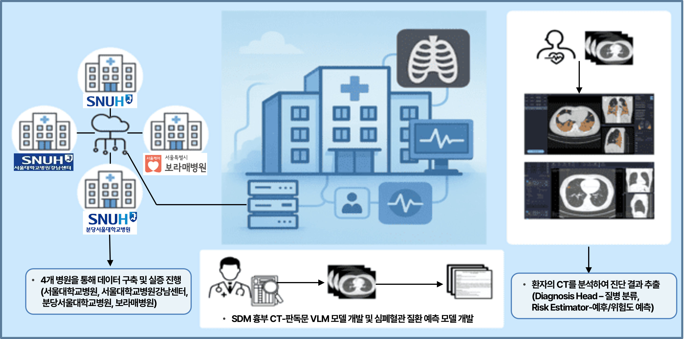

# **TANGO 2** #
This is the official repository contains the sources of the project **TANGO 2** \
(**t**arget **a**daptive **n**o-code neural network **g**eneration and **o**peration framework version **2**), a follow-up to [**TANGO**](https://github.com/ML-TANGO/TANGO).

---

## [**2025 4th TANGO Community Conference**](http://tangoai.or.kr) ##
* [**STCenter** (과학기술컨벤션센터 / 한국과학기술회관)](https://www.stcenter.or.kr/)
* [**B1F, 22, Teheran-ro 7-gil, Gangnam-gu, Seoul, Republic of Korea** (서울시 강남구 테헤란로 7길 22, 과학기술회관 대회의실1)](https://www.google.com/maps/place/%ED%95%9C%EA%B5%AD%EA%B3%BC%ED%95%99%EA%B8%B0%EC%88%A0%ED%9A%8C%EA%B4%80/data=!4m15!1m8!3m7!1s0x357ca157ddbed32f:0x29432bdf4b90af3d!2z7ISc7Jq47Yq567OE7IucIOqwleuCqOq1rCDthYztl6TrnoDroZw36ri4IDIy!3b1!8m2!3d37.500961!4d127.0306229!16s%2Fg%2F11bzn06m8v!3m5!1s0x357ca157de00cbb3:0xe5266ee55f1d179e!8m2!3d37.5007029!4d127.0307453!16s%2Fg%2F1tf8508h?entry=ttu&g_ep=EgoyMDI1MTAxNC4wIKXMDSoASAFQAw%3D%3D)
* **2025-11-06 / 13:30~17:30**

---

## Introduction <a name="intro"></a> ##


* TANGO 2 is a follow-up project to [TANGO](https://github.com/ML-TANGO/TANGO), an automatic neural network generation and deployment framework, and aims to perform proof-of-the-project for the SDx industry. 

* The source tree is organized with the MSA (microservice architecture) principles: each subdirectory contains component container source code. 
Due to the separation of source directory, component container developers just only work on their own isolated subdirectory and publish minimal REST API to serve project manager container's service request.

```bash
TANGO2
   ├── Data_Augmentation
   │   └── fewshot_prompting
   │
   ├── Deployment
   │   ├── Optimization
   │   └── Runtime_Engine
   │
   ├── GenAI_Platform
   │
   ├── Learning
   │
   ├── SDF
   │
   ├── SDM
   │
   └── SDS
       ├── dataset
       └── simulator
```


---

## └─ Data_Augmentation ##


---

## └─ Deployment ##


---

## └─ GenAI_Platform ##


---

## └─ Learning ##


---

## └─ SDF ##
* Software Defined Farming


---

## └─ SDM ##
* Software Defined Medicine


---

## └─ SDS ##
* Software Defined Ship


---

#### Acknowledgement <a name="ack"></a> ####
This proejct was supported by [_Institute of Information & Communications Technology Planning & Evaluation (IITP)_](https://www.iitp.kr/) grant funded by the [_Ministry of Science and Information Communication Technology (MSIT)_](https://www.msit.go.kr/), Republic of Korea (**No. 2021-0-00766**, _Development of Integrated Development Framework that supports Automatic Neural Network Generation and Deployment optimized for Runtime Environment_).

---

[//]: # (## 기술개요)

[//]: # ()
[//]: # (* SDx 산업별로 도메인 특화 생성형AI 모델을 생성하고, 클라우드/엣지/온디바이스 배포를 지원하며 해당 결과물에 대하여 SDx 분야 실증을 수행 )

[//]: # (  * 생성형AI 개발지원 시스템SW 기술은 생성형AI&#40;Generative AI&#41;를 효과적으로 개발, 배포, 실행, 운영 및 최적화하는 통합개발 프레임워크로서, 기존 MLOps가 전통적인 머신러닝 모델의 배포 및 운영 자동화를 지원했다면 생성형AI 지원 SW 프레임워크 기술은 생성형AI&#40;LLM, LAM 등&#41; 모델의 생성, 관리, 최적화는 물론 배포, 실행, 운영관리 까지의 전과정에 초점을 맞춘 새로운 인공지능용 시스템SW임 )

[//]: # (  * SDS&#40;Software Defined Ship&#41; 실증 : 기존 센서융합 기술을 이용한 perception중심의 AI 에이전트 개발을 뛰어넘어, 탐지된 주변 객체 및 환경 정보를 바탕으로 상황을 이해하고 묘사하고, 항행규칙을 기반으로 해당 상황에 맞는 항해 의사결정을 실증)

[//]: # (  * SDF&#40;Software Defined Farming&#41; 실증 : 스마트팜 고도화를 위해 인공지능&#40;LLM, LAM&#41; 기반의 Software Defined Farming &#40;SDF&#41; 시스템을 구축하고, AI 모델의 지속 학습을 통한 지능형 SDF 실증)

[//]: # (  * SDM&#40;Software Defined Medicine&#41; 실증 : 의료 도메인 특화 멀티모달&#40;흉부 CT-판독문&#41; 인공지능 &#40;Large Vision-Language Model&#41; 기반의 Software Defined Medicine &#40;SDM&#41; 시스템을 개발하고 병원에서 실증)

[//]: # (       )
[//]: # ()

[//]: # ()
[//]: # (----)

[//]: # ()
[//]: # (## 기술의 필요성)

[//]: # ()
[//]: # (### 기술 현황)

[//]: # (SDx 산업이 단순 진단 서비스에서 LLM/LAM을 확장한 예측과 함께 인간의 개입 없이도 스스로 환경을 인식하고, 데이터를 분석하며, 학습을 통해 효율적으로 문제를 해결&#40;예: 동작제어&#41;할 수 있는 생성형AI로 진화함에 따라 이를 효율적으로 지원할 수 있는 생성형AI 지원 시스템SW 기술이 필요하나 전 세계적으로도 관련 기술은 부재)

[//]: # ()
[//]: # ( * NVIDIA, 구글, 메타, 마이크로소프트 등 글로벌 선도 기업들은 생성형AI 관련 시장 선점을 위해 시스템SW에 기반한 생태계 구축에 막대한 투자를 진행 중이며, 이는 단순한 모델 성능 향상을 넘어 실제 사용가능한 제품/서비스 구현을 위한 시스템SW 프레임워크 제공이 목표임)

[//]: # (   * NVidia는 CUDA를 중심으로 추론 엔진인 TensorRT, 모델 실행 병렬화를 지원하는 Megatron-LM, 클라우드-엣지환경 대응 런타임 모듈인 Triton Server 등의 시스템SW를 제공하고 있으나, 이는 자사 HW에만 특화된 기술임)

[//]: # (   * 구글은 TPU, TensorFlow, XLA 등 자사 솔루션을 기반으로 모델 최적화, 자동 병렬화 및 초거대모델 학습용 SW 등 전용 시스템SW 개발에 노력 중)

[//]: # (   * Meta는 생성형 모델을 위한 분산 처리 및 경량화 기술 개발에 집중하는 등 PyTorch 기반 시스템SW에 지속적 투자 진행 중)

[//]: # (   * 마이크로소프트는 자사 클라우드 기반으로 학습/추론 시스템SW 프레임워크 구축에 노력 중)

[//]: # ()
[//]: # ( * 현재 국내 시스템SW는 생성형AI를 효율적으로 실행하기 위한 다양한 하드웨어 통합 지원 운영체제, 대규모 모델의 분산 컴퓨팅을 위한 미들웨어 기술 및 실시간 추론을 위한 AI 컴퓨팅 측면에서 아직 충분한 지원을 제공하지 못하고 있음)

[//]: # (   * 국내에서 생성형AI의 경쟁력을 확보하기 위해서는, 단순히 모델 알고리즘 개발에 그치지 않고, 이를 효율적이며 안정적으로 구동할 수 있는 시스템SW 기술 확보가 시급함)

[//]: # (   * AI 가속 활용 최적화 연구는 NVIDIA GPU에 집중되어 있어, 다양한 HW 환경에서 범용적으로 활용할 수 있는 시스템SW 기술은 부족)

[//]: # ()
[//]: # (### 필요성)

[//]: # (SDx 산업 도메인 현장에서 AX &#40;AI Transformation : 인공지능 전환&#41; 전환을 활성화하기 위한 생성형AI 서비스 요구가 증대되고 있으나, SDx 배포 및 최적 실행을 위한 시스템SW 기술은 부족)

[//]: # ()
[//]: # (* SDx를 위한 온디바이스 환경에서도 고성능 AP&#40;Application Processor&#41;가 사용됨에 따라, 기존 컨벌루션 기반의 신경망 응용에서 생성형AI를 사용하는 신경망 응용 서비스로 진화 중)

[//]: # (* 기존 단순 Q&A를 위한 챗봇 수준을 넘어 지능형 서비스를 자동 생성하는 산업 도메인의 수요가 증대되고 있음)

[//]: # (* 생성형AI의 대규모 모델을 효율적으로 운영하기 위해서는 H/W 가속화, 디바이스 드라이버, ROS2 &#40;Robot Operating System 2&#41; 미들웨어, 그리고 경량 추론엔진 AI 컴퓨팅 기술 스택까지 전문화된 시스템SW가 필요함)

[//]: # ()
[//]: # (### 본 과제 개발의 중요성)

[//]: # (IT 전문 기업이 아닌 기업은 자사의 프로세스, 제품, 서비스에 AI 기술 접목이 어려우며, 특히 생성형AI가 AI의 성능을 극대화하는 현시점에 이를 활용하는 서비스를 제대로 구현하지 못하는 상황이므로, 이런 어려움을 해결해 줄 수 있는 SW 기술 필요)

[//]: # ()
[//]: # (* SDx 산업분야의 응용 서비스 개발 인력은 생성형AI 서비스 개발에 필요한 인공지능의 이론 및 경험이 부족하여, SDx 산업 분야별로 특화된 생성형AI 신경망 모델의 생성, 배포 및 지속적 유지보수까지를 통합 관리하는 시스템SW 프레임워크 제공이 필요함)

[//]: # ( > 구글, MS, 아마존 등 MLOps 도구들은 생성형AI 개발을 일부 지원하고 있으나, Hugging Face  모델의 단순 연동만을 지원하고 있으며, 생성형AI 개발 전과정의 자동화를 지원하는 MLOps SW 프레임워크 기술도 부재)

[//]: # (  )
[//]: # (* AI에 대한 전문 지식이 없이도 자사의 데이터를 학습시키고, 자신만의 모델이 자동으로 생성되며, 적합한 디바이스/제품에 활용될 수 있도록 경량화/최적화되며, 다양한 디바이스, 컴퓨팅 환경에서도 잘 동작할 수 있는 SW 확보가 시급)

[//]: # (* 메타의 LLama, 중국의 딥시크 등이 이미 공개 소스로 제공되고 있는 글로벌 동향에 대응하기 위해서는 우리나라 생성형 인공지능 관련 기술을 통합하고 집단지성을 창출할 수 있는 공개 SW 개발 정책 추진이 필수적임)