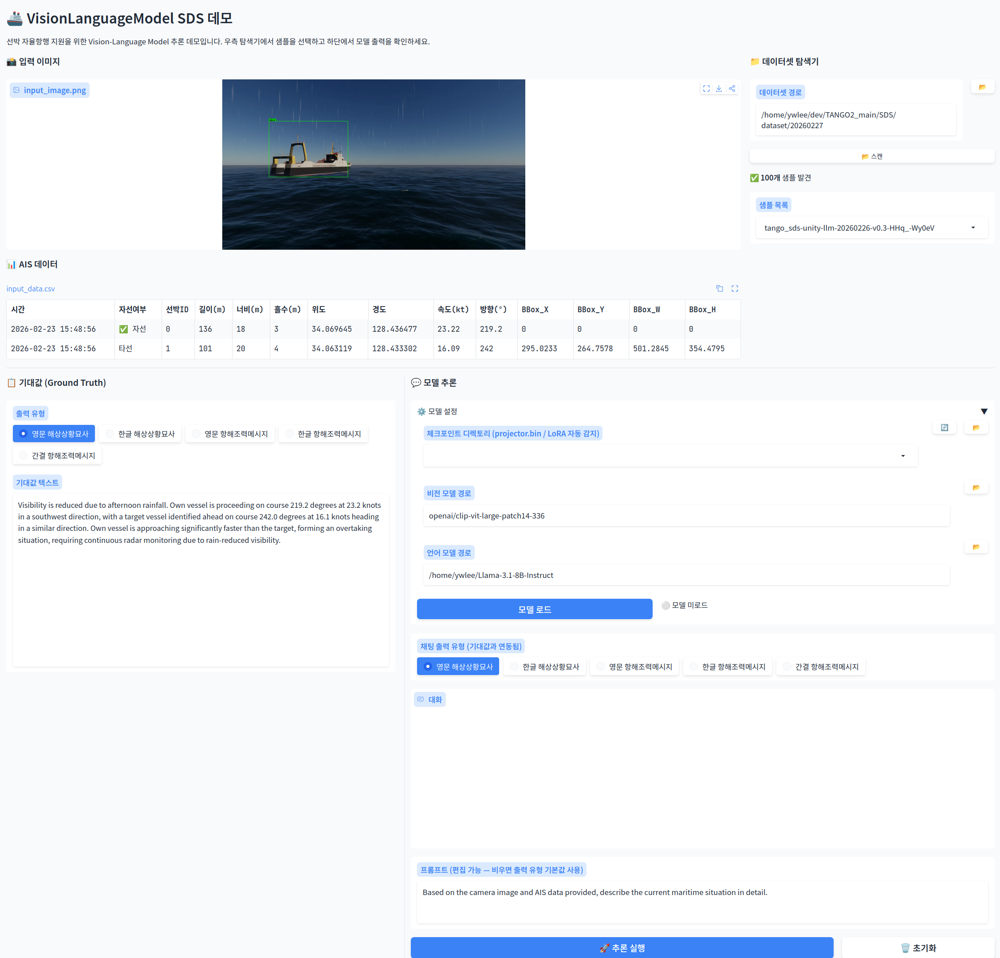

# VisionLanguageModel

선박 자율항행 지원을 위한 Vision-Language Model (VLM) 구현입니다.  
CLIP 비전 인코더와 Llama 3.1 / Qwen3 언어 모델을 MLP 프로젝터로 연결하는 LLaVA 구조이며,  
SDS(Software-defined Ship) 해상 도메인 데이터셋에 특화된 학습 파이프라인을 제공합니다.

---

## 목차

1. [아키텍처 개요](#1-아키텍처-개요)
2. [하드웨어 / CUDA 요구사항](#2-하드웨어--cuda-요구사항)
3. [가상환경 구성](#3-가상환경-구성)
4. [모델 가중치 준비](#4-모델-가중치-준비)
5. [데이터셋 준비](#5-데이터셋-준비)
6. [동작 확인 (로드 테스트)](#6-동작-확인-로드-테스트)
7. [학습 파이프라인](#7-학습-파이프라인)
8. [추론 테스트](#8-추론-테스트)
9. [데모 웹 앱](#9-데모-웹-앱)
10. [프로젝트 구조](#10-프로젝트-구조)
11. [W&B 학습 모니터링](#11-wb-학습-모니터링)

---

## 1. 아키텍처 개요

```
입력 이미지
    │
    ▼
[Vision Encoder]   CLIP ViT-L/14-336  (고정, 1024-dim, 576 패치 토큰)
    │
    ▼
[MLP Projector]    mlp2x_gelu         (학습, vision_dim → llm_dim)
    │
    ▼  (576개 시각 토큰을 <image> 위치에 삽입)
[Language Model]   Llama 3.1-8B-Instruct / Qwen3-8B
    │
    ▼
텍스트 출력 (해상상황묘사, 항해조력메시지 등)
```

### 4단계 학습 파이프라인

| 단계 | 스크립트 | 데이터 | 학습 대상 | 고정 | 목적 |
|------|---------|--------|-----------|------|------|
| Phase 1 | `train_projector.sh` | CC3M 595K | Projector | CLIP + LLM | 이미지↔텍스트 임베딩 정렬 |
| Phase 2 | `train_lora.sh` | CC3M 595K | Projector + LLM(LoRA) | CLIP | 일반 시각-언어 파인튜닝 |
| Phase 3 | `train_lora_marine.sh` | LLaMarine 54K (텍스트 전용) | LLM(LoRA) 계속학습 | 전부 | 해양 도메인 지식 주입 |
| Phase 4 | `train_lora_sds.sh` | SDS 100개 (이미지+텍스트) | Projector + LLM(LoRA) 계속학습 | CLIP | SDS 태스크 특화 |

> Phase 3는 이미지 없이 텍스트만 사용하므로 Vision Encoder / Projector를 로드하지 않습니다.

---

## 2. 하드웨어 / CUDA 요구사항

| 항목 | 권장 |
|------|------|
| GPU | NVIDIA RTX5090 (32GB) 또는 A100 (40GB) × N |
| CUDA | 12.8 |
| cuDNN | - |
| OS | Ubuntu 24.04 |

---

## 3. 가상환경 구성

### 3-1. Miniforge 설치

이미 설치되어 있으면 건너뜁니다.

```bash
wget "https://github.com/conda-forge/miniforge/releases/latest/download/Miniforge3-$(uname)-$(uname -m).sh"
bash Miniforge3-$(uname)-$(uname -m).sh -b -p $HOME/miniforge3
$HOME/miniforge3/bin/conda init bash   # 또는 zsh
source ~/.bashrc
```

### 3-2. 채널 설정 확인

> **중요: 라이센스 문제**  
> Anaconda 기본 채널(`defaults`)은 상업적 환경에서 유료입니다.  
> 연구·기관 환경에서는 반드시 `defaults`를 삭제하고 아래 무료 채널만 사용하십시오.

```bash
# Miniforge 는 conda-forge 를 기본 채널로 사용함
conda config --show channels
```

올바른 출력:
```
channels:
  - nvidia
  - pytorch
  - conda-forge
```

### 3-3. 가상환경 생성

```bash
conda create -n eva python=3.11 pip -y
conda activate eva
```

### 3-4. PyTorch 설치 (CUDA 12.8)

```bash
pip install torch==2.11.0 torchvision --index-url https://download.pytorch.org/whl/cu128
```

설치 확인:
```bash
python -c "import torch; print(torch.__version__); print('CUDA:', torch.cuda.is_available())"
# 출력 예: 2.11.0+cu128   CUDA: True
```

### 3-5. 나머지 패키지 설치

```bash
pip install \
    transformers==5.3.0 \
    peft==0.18.1 \
    accelerate==1.13.0 \
    deepspeed==0.18.8 \
    wandb==0.26.1 \
    gradio==6.14.0 \
    torchinfo==1.8.0 \
    sentencepiece==0.2.1 \
    pandas \
    pillow \
    numpy \
    huggingface_hub
```

---

## 4. 모델 가중치 준비

### 비전 인코더

CLIP은 `transformers`가 Hugging Face Hub에서 자동 다운로드합니다.  
처음 실행 시 인터넷 연결이 필요하며, 이후 캐시(`~/.cache/huggingface/`)에서 로드됩니다.

| 모델 | HF 이름 | 크기 |
|------|---------|------|
| CLIP ViT-L/14-336 | `openai/clip-vit-large-patch14-336` | ~890 MB |

### 언어 모델 (로컬 다운로드 필요)

```bash
# Hugging Face - Access Token 을 사용하여 로그인 필요
hf auth login
```

```
# Llama 3.1 8B Instruct (HF 계정 + Meta 라이센스 동의 필요)
hf download meta-llama/Llama-3.1-8B-Instruct \
    --local-dir ~/Llama-3.1-8B-Instruct

# Qwen3 8B (선택)
hf download Qwen/Qwen3-8B \
    --local-dir ~/Qwen3-8B
```

---

## 5. 데이터셋 준비

### Phase 1/2 — LLaVA-CC3M-Pretrain-595K

일반적인 이미지-캡션 정렬 학습에 사용합니다.

```bash
# 약 40 GB (다운로드 후 images.zip 압축 해제 필요)
hf download liuhaotian/LLaVA-CC3M-Pretrain-595K \
    --local-dir <YOUR_DATA_ROOT>/LLaVA-CC3M-Pretrain-595K \
    --repo-type dataset
```

```
LLaVA-CC3M-Pretrain-595K/
├── chat.json
└── images/
```

### Phase 3 — LLaMarine-SFT (텍스트 전용 해양 도메인)

54,657개의 해양 instruction-output 쌍으로 구성된 텍스트 전용 데이터셋입니다.  
이미지 없이 해양 도메인 지식(AIS, COLREG, 충돌 회피 등)을 LLM에 주입합니다.

```bash
hf download pentagoniac/llamarine-sft \
    --local-dir <YOUR_DATA_ROOT>/llamarine-sft \
    --repo-type dataset
```

```
llamarine-sft/
└── data/
    └── train-00000-of-00001.parquet   # columns: instruction, output
```

### Phase 4 — SDS 데이터셋

내부 시뮬레이션 데이터셋. 각 샘플 구조:

```
{sample_id}/
├── input_image.png           # 1920×1080 해상 시뮬레이션 이미지
├── input_data.csv            # AIS 데이터 (자선/타선 위치·속도·방향·bbox)
├── output_describe_en.txt    # 영문 해상상황묘사
├── output_describe_kor.txt   # 국문 해상상황묘사
├── output_advice_en.txt      # 영문 항해조력메시지
├── output_advice_kor.txt     # 국문 항해조력메시지
└── output_advice_compact.txt # 간결 국문 항해조력메시지
```

LLaVA JSON 포맷으로 변환 (3가지 시나리오 생성):

```bash
python scripts/prepare_sds_dataset.py \
    --dataset_dir <YOUR_TANGO2_PATH>/SDS/dataset/20260227
```

출력:
```
data/
├── sds_train_en.json         # 100개: 영문 해상상황묘사 + 영문 항해조력
├── sds_train_ko.json         # 100개: 한글 해상상황묘사 + 한글 항해조력
└── sds_train_ko_compact.json # 100개: 한글 간결 항해조력
```

각 JSON 샘플 형식:
```json
{
  "id": "{sample_id}_en",
  "image": "{sample_id}/input_image.png",
  "conversations": [
    {
      "from": "human",
      "value": "<image>\n[Vessel AIS Information]\n...\n\nBased on the camera image and AIS data provided, describe the current maritime situation and provide appropriate navigational advice in accordance with COLREG rules."
    },
    {
      "from": "gpt",
      "value": "{output_describe_en}\n\n{output_advice_en}"
    }
  ]
}
```

---

## 6. 동작 확인 (로드 테스트)

학습 전 모델 구조와 forward pass가 정상인지 확인합니다.

```bash
PYTHON=$HOME/miniforge3/envs/eva/bin/python

# 스크립트 파라미터 정의
$PYTHON load_test.py  \
    --vision \        # 비전 모델 경로
    --llm \           # 언어 모델 경로
    --device \        # CPU, 또는 GPU
    --dtype \         # 데이터 타입
    --generate \      # 텍스트 응답 생성 유무
    --test_image      # 테스트 이미지 경로

# 사용 예시
$PYTHON load_test.py --generate                               # 텍스트 생성까지
$PYTHON load_test.py --test_image /path/to/image.png --generate
```

정상 출력 마지막 줄:
```
ALL CHECKS PASSED — Model architecture is functional
```

---

## 7. 학습 파이프라인

### Phase 1 — Projector 사전학습

비전 인코더와 LLM을 고정하고 MLP 프로젝터만 학습합니다.

```bash
# scripts/train_projector.sh 상단의 경로 변수를 환경에 맞게 수정 후 실행
bash scripts/train_projector.sh

# 멀티 GPU
CUDA_VISIBLE_DEVICES=0,1,2,3,4,5 bash scripts/train_projector.sh
```

주요 하이퍼파라미터:

```bash
BATCH_SIZE=8        # GPU당 배치
GRAD_ACCUM=4
LEARNING_RATE=1e-3
NUM_EPOCHS=1
MAX_STEPS=5000      # 조기 종료
```

결과물: `checkpoints/clip_llama31_projector/projector.bin`

---

### Phase 2 — CC3M LoRA 파인튜닝

Phase 1 프로젝터를 불러와 LoRA로 LLM을 파인튜닝합니다.

```bash
bash scripts/train_lora.sh
```

주요 하이퍼파라미터:

```bash
PROJECTOR_PATH="checkpoints/clip_llama31_projector/projector.bin"
OUTPUT_DIR="checkpoints/clip_llama31_lora"
BATCH_SIZE=4
GRAD_ACCUM=4
LEARNING_RATE=2e-4
NUM_EPOCHS=3
LORA_R=128
LORA_ALPHA=256
```

결과물: `checkpoints/clip_llama31_lora/`

```
clip_llama31_lora/
├── projector.bin
├── adapter_model.safetensors
├── adapter_config.json
├── tokenizer.json
├── tokenizer_config.json
└── vlm_config.json
```

---

### Phase 3 — LLaMarine 텍스트 전용 LoRA 계속학습

기존 LoRA 체크포인트에서 이어받아 해양 도메인 텍스트 데이터로 LLM을 추가 학습합니다.  
Vision Encoder / Projector를 로드하지 않아 메모리 효율적입니다.

```bash
bash scripts/train_lora_marine.sh
```

주요 하이퍼파라미터:

```bash
LLM_MODEL="/path/to/Llama-3.1-8B-Instruct"
LORA_PATH="checkpoints/clip_llama31_lora"          # 이어받을 LoRA
DATA_PATH="/path/to/llamarine-sft/data/train-00000-of-00001.parquet" # 54,657개
OUTPUT_DIR="checkpoints/clip_llama31_lora_marine"
BATCH_SIZE=2
GRAD_ACCUM=8
LEARNING_RATE=5e-5      # 기존 LoRA 대비 낮게 (catastrophic forgetting 방지)
NUM_EPOCHS=1
```

6 GPU 기준 iteration: `54,657 ÷ (2×8×6) = 약 570 steps`

결과물: `checkpoints/clip_llama31_lora_marine/`  
(projector.bin을 `clip_llama31_lora`에서 자동 복사)

> `train_text_lora.py`를 직접 실행할 수도 있습니다:
> ```bash
> python train_text_lora.py \
>     --llm_model /path/to/Llama-3.1-8B-Instruct \
>     --lora_path checkpoints/clip_llama31_lora \
>     --data_path /path/to/llamarine-sft/data/train-00000-of-00001.parquet \
>     --output_dir checkpoints/clip_llama31_lora_marine \
>     --num_epochs 1 --batch_size 2 --grad_accum 8
> ```

---

### Phase 4 — SDS 도메인 LoRA 파인튜닝

SDS 데이터셋 100개로 시각+텍스트 통합 파인튜닝을 진행합니다.  
3가지 시나리오 중 `SCENARIO` 환경 변수로 선택합니다.

```bash
# 사전 준비: SDS JSON 데이터 생성
python scripts/prepare_sds_dataset.py

# 영문 시나리오 (AIS EN + 해상상황묘사EN + 항해조력EN)
SCENARIO=en         bash scripts/train_lora_sds.sh

# 한글 시나리오 (AIS KO + 해상상황묘사KO + 항해조력KO)
SCENARIO=ko         bash scripts/train_lora_sds.sh

# 한글 간결 시나리오 (AIS KO + 간결항해조력KO)
SCENARIO=ko_compact bash scripts/train_lora_sds.sh
```

주요 하이퍼파라미터:

```bash
BATCH_SIZE=1
GRAD_ACCUM=2
LEARNING_RATE=2e-4
NUM_EPOCHS=10           # 소규모 데이터셋: 충분한 반복
```

6 GPU 기준 iteration: `100 ÷ (1×2×6) × 10 = 약 80 steps`

결과물:
```
checkpoints/
├── sds_lora_en/
├── sds_lora_ko/
└── sds_lora_ko_compact/
```

각 디렉토리에 `projector.bin`이 자동 복사됩니다.

> 스크립트는 `clip_llama31_lora_marine`이 있으면 우선 사용하고, 없으면 `clip_llama31_lora`로 폴백합니다.

---

### `train.py` 직접 실행

```bash
PYTHON=$HOME/miniconda3/envs/eva/bin/python

# Phase 1: Projector 학습
$PYTHON train.py \
    --train_type projector \
    --vision_model openai/clip-vit-large-patch14-336 \
    --llm_model /path/to/Llama-3.1-8B-Instruct \
    --data_path /path/to/LLaVA-CC3M-Pretrain-595K/chat.json \
    --image_dir /path/to/LLaVA-CC3M-Pretrain-595K/images \
    --output_dir checkpoints/my_projector \
    --num_epochs 1 --batch_size 8 --grad_accum 4

# Phase 2/3: 신규 LoRA
$PYTHON train.py \
    --train_type lora \
    --projector_path checkpoints/my_projector/projector.bin \
    --data_path /path/to/LLaVA-CC3M-Pretrain-595K/chat.json \
    --image_dir /path/to/LLaVA-CC3M-Pretrain-595K/images \
    --output_dir checkpoints/my_lora \
    --num_epochs 3 --batch_size 4 --lora_r 128 --lora_alpha 256

# Phase 4: 기존 LoRA 이어받아 계속학습
$PYTHON train.py \
    --train_type lora \
    --projector_path checkpoints/my_lora/projector.bin \
    --resume_lora_path checkpoints/my_lora \
    --data_path data/sds_train_en.json \
    --image_dir /path/to/SDS/dataset/20260227 \
    --output_dir checkpoints/my_sds_lora \
    --num_epochs 10 --batch_size 1 --grad_accum 2
```

주요 `train.py` 인수:

| 인수 | 설명                                |
|------|-----------------------------------|
| `--train_type` | `projector` / `lora` / `full`     |
| `--projector_path` | Phase 1 결과 projector.bin 경로       |
| `--resume_lora_path` | 기존 LoRA 디렉토리 (이어받기, Phase 2/3/4용) |
| `--lora_r` / `--lora_alpha` | LoRA rank / alpha (기본: 128 / 256) |
| `--max_steps` | epoch 대신 step 수로 조기 종료            |
| `--wandb_project` | W&B 프로젝트명 (생략 시 비활성화)             |

---

## 8. 추론 테스트

학습된 체크포인트로 단일 이미지 추론을 실행합니다.

```bash
PYTHON=$HOME/miniforge3/envs/eva/bin/python
CKPT="checkpoints/sds_lora_en"

$PYTHON test.py \
    --projector_path "$CKPT/projector.bin" \
    --lora_path      "$CKPT" \
    --llm_model      "/path/to/Llama-3.1-8B-Instruct" \
    --image          "/path/to/sample/input_image.png" \
    --question       "[Vessel AIS Information]
- Own vessel (ID:0) | Lat:34.45 Lon:127.73 | Speed:17.5kt Heading:141° | Size:93m x 28m Draft:3m
- Nearby vessel (ID:1) | Lat:34.44 Lon:127.73 | Speed:20.1kt Heading:115° | Size:134m x 24m Draft:4m | BoundingBox:[x=975 y=318 w=408 h=263]

Based on the camera image and AIS data provided, describe the current maritime situation and provide appropriate navigational advice in accordance with COLREG rules." \
    --max_new_tokens 512 \
    --repetition_penalty 1.1
```

주요 `test.py` 인수:

| 인수 | 기본값 | 설명 |
|------|--------|------|
| `--projector_path` | (필수) | projector.bin 경로 |
| `--lora_path` | None | LoRA 디렉토리 (없으면 projector만 사용) |
| `--llm_model` | `/home/ywlee/Llama-3.1-8B-Instruct` | LLM 경로 |
| `--max_new_tokens` | 512 | 최대 생성 토큰 수 |
| `--do_sample` | False | 샘플링 여부 (False=greedy) |
| `--repetition_penalty` | 1.0 | 반복 억제 (1.1 권장) |

---

## 9. 데모 웹 앱

SDS 데이터셋을 탐색하고 모델 추론 결과를 채팅 형태로 확인하는 Gradio 앱입니다.

```bash
bash demo/run.sh           # http://0.0.0.0:7860
bash demo/run.sh 8080      # 포트 변경

# 공개 URL 생성 (Gradio 터널)
python demo/app.py --share
```

### 화면 구성

|                                                              |                                                                           |
|:-------------------------------------------------------------|:--------------------------------------------------------------------------|
| 📸 입력 이미지 (bbox 오버레이) <br> 📊 AIS 데이터 테이블                    | 📁 데이터셋 탐색기 <br> - 경로 입력 + 📂 탐색 <br> - 스캔 → 샘플 드롭다운                      |
| 📋 기대값 (Ground Truth) <br> - 5가지 출력 유형 선택 <br> - 레퍼런스 텍스트 표시 | ⚙️ 모델 설정 <br> - 체크포인트 선택 + 📂 <br> - 비전/LLM 경로 + 📂 <br> - 모델 로드 버튼 <br> 💬 추론 결과 채팅 |



### 주요 기능

**데이터셋 탐색기**
- 경로 입력창 옆 📂 버튼으로 파일 탐색기 열기
- 샘플 선택 시 이미지(타선 바운딩박스 초록색 오버레이)와 AIS 표 자동 로드

**기대값 확인**
- 5가지 출력 유형 (영문 묘사 / 한글 묘사 / 영문 조력 / 한글 조력 / 간결 조력) 전환
- 출력 유형 선택이 추론 채팅과 연동됨

**모델 설정**
- 체크포인트 드롭다운: `checkpoints/` 하위 폴더를 자동 스캔, LoRA 포함 시 `[LoRA]` 표시
- 📂 버튼으로 CHECKPOINTS_ROOT 외부 경로도 탐색 가능
- 비전 모델 / LLM 경로도 각각 📂 탐색 지원
- **모델 로드** 버튼: 클릭 시 "로딩 중..." 표시 → 완료 후 복원
- 이미 로드된 상태에서 재로드 시 GPU 메모리 자동 해제 후 재로드
- Projector 전용 체크포인트와 LoRA 포함 체크포인트 자동 감지

**추론**
- 출력 유형에 따라 AIS 텍스트 언어 자동 전환 (영문 유형 → EN, 한글 유형 → KO)
- Qwen3의 `<think>...</think>` 블록 자동 제거

---

## 10. 프로젝트 구조

```
VisionLanguageModel/
│
├── model/
│   ├── config.py              # VLMConfig 데이터클래스
│   ├── vision_encoder.py      # CLIP 래퍼 (feature 추출, 이미지 프로세서)
│   ├── projector.py           # MLP 프로젝터 (mlp2x_gelu)
│   ├── vlm_v2.py              # VisionLanguageModelV2 메인 클래스, build_model()
│   └── __init__.py
│
├── data/
│   ├── dataset.py             # LLaVADataset, DataCollatorForVLM
│   ├── __init__.py
│   ├── sds_train_en.json      # SDS 영문 학습 데이터 (100개) ← prepare_sds_dataset.py 생성
│   ├── sds_train_ko.json      # SDS 한글 학습 데이터 (100개)
│   └── sds_train_ko_compact.json  # SDS 한글 간결 (100개)
│
├── scripts/
│   ├── prepare_sds_dataset.py # SDS → LLaVA JSON 변환 (3가지 시나리오)
│   ├── train_projector.sh     # Phase 1: Projector 사전학습
│   ├── train_lora.sh          # Phase 2: CC3M LoRA 파인튜닝
│   ├── train_lora_marine.sh   # Phase 3: LLaMarine 텍스트 전용 LoRA 계속학습
│   ├── train_lora_sds.sh      # Phase 4: SDS 도메인 LoRA 파인튜닝 (3 시나리오)
│   ├── zero2.json             # DeepSpeed ZeRO-2 설정
│   └── zero3.json             # DeepSpeed ZeRO-3 설정
│
├── demo/
│   ├── app.py                 # Gradio 데모 앱
│   └── run.sh                 # 데모 실행 스크립트
│
├── train.py                   # 이미지+텍스트 학습 진입점 (Phase 1/2/4)
├── train_text_lora.py         # 텍스트 전용 LoRA 학습 진입점 (Phase 3)
├── test.py                    # 단일 이미지 추론 테스트
├── load_test.py               # 아키텍처·forward pass 검증
├── model_summary.py           # 모델 구조 출력 + W&B 로깅
├── requirements.txt
└── README.md
```

### 체크포인트 디렉토리 구조

LoRA 체크포인트에는 다음 파일이 포함되어야 VLM 전체를 구동할 수 있습니다:

```
{checkpoint}/
├── projector.bin              # MLP 프로젝터 가중치 (필수)
├── adapter_config.json        # LoRA 설정 (있으면 LoRA로 인식)
├── adapter_model.safetensors  # LoRA 가중치
├── tokenizer.json
├── tokenizer_config.json
└── vlm_config.json            # 학습 시 사용한 VLMConfig 스냅샷
```

---

## 11. W&B 학습 모니터링

모든 학습 스크립트에 `--wandb_project vlm-v2`가 기본 설정되어 있습니다.

```bash
wandb login   # 최초 1회
```

로깅 항목:
- `train/loss`, `train/learning_rate`, `train/grad_norm`
- `gpu/{i}/mem_allocated_GB`, `gpu/{i}/mem_reserved_GB` (GPU별)
- 모델 설정, 하이퍼파라미터 (run config)

W&B 없이 실행:
```bash
WANDB_MODE=disabled bash scripts/train_projector.sh
```

모델 구조 시각화:
```bash
python model_summary.py                        # 콘솔 출력
python model_summary.py --wandb_project vlm-v2 # W&B 아티팩트 업로드
```

---
